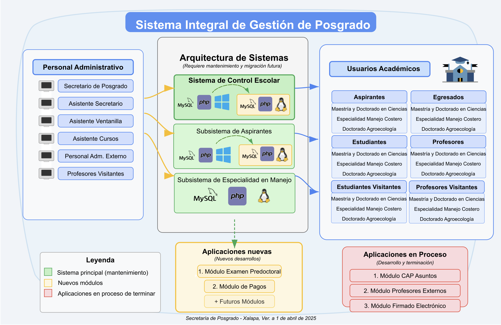

**DIAGRAMA CONCEPTUAL**

*Anexo 2026 — diagrama de alto nivel del alcance funcional o arquitectura de la solucion (actualizar si el diseno evoluciona).*

| Elaboro                                                                                                                                                |     | Reviso                                                                                  |
|--------------------------------------------------------------------------------------------------------------------------------------------------------|-----|-----------------------------------------------------------------------------------------|
|  |     |                                                                                         |
| Dr. Oscar Luis Briones Villarreal, Secretario de Posgrado                                                                                              |     | Joaquin Cazares Martinez, Coordinador de Tecnologias de la Informacion y Comunicaciones |

Xalapa, Ver., *\[fecha 2026\]*
