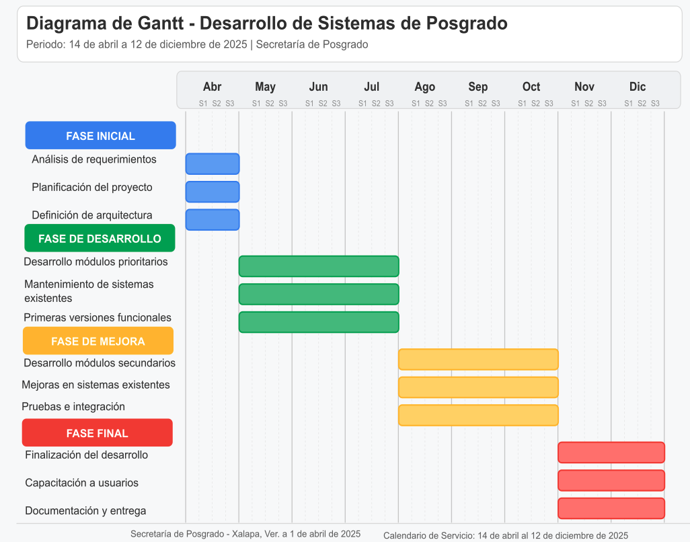

**CALENDARIO DEL SERVICIO**

> El calendario de servicio especifica **nueve (9) meses** a partir de la aceptacion y firma del instrumento juridico correspondiente, para la prestacion del servicio contratado. Periodo de referencia para la planificacion institucional: **del 1 de abril de 2026 al 31 de diciembre de 2026** (ajustar fechas definitivas al instrumento juridico firmado).

| Elaboro                                                                                                                                       |     | Reviso                                                                                  |
|-----------------------------------------------------------------------------------------------------------------------------------------------|-----|-----------------------------------------------------------------------------------------|
|  |     |                                                                                         |
| Dr. Oscar Luis Briones Villarreal, Secretario de Posgrado                                                                                     |     | Joaquin Cazares Martinez, Coordinador de Tecnologias de la Informacion y Comunicaciones |

Xalapa, Ver., *\[fecha 2026\]*
