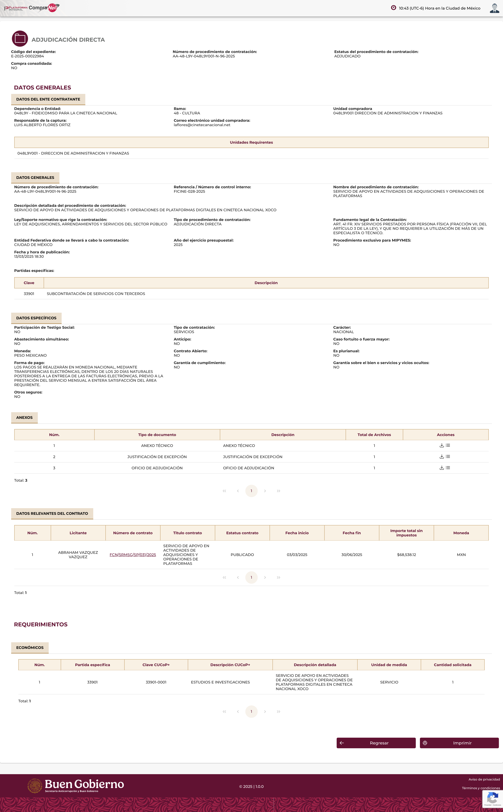
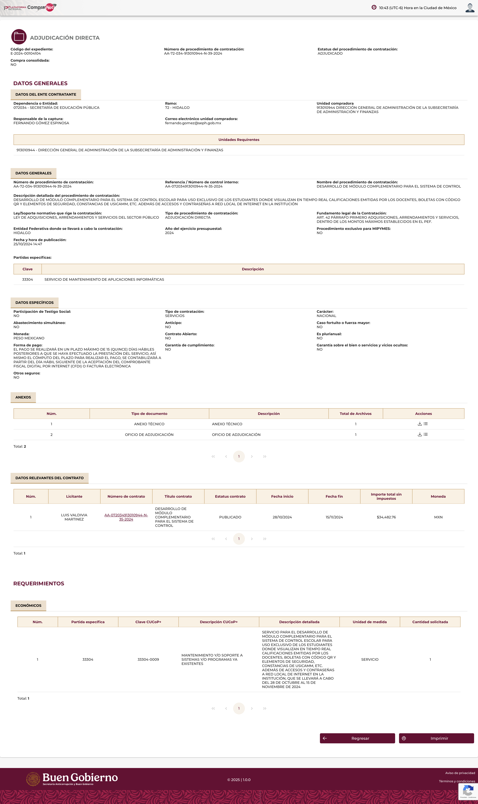

**COMPRANET**

Se procedio a realizar la busqueda en la plataforma integral CompraNet de proveedores u operaciones relacionadas con servicios similares al objeto de esta contratacion (desarrollo, mantenimiento o tecnologias de la informacion). A continuacion se documentan capturas de referencia; **actualizar la busqueda** conforme a la fecha de tramite 2026 y a los criterios que indique el area de adquisiciones.

| Elaboro                                                                                                                                      |     | Reviso                                                                                  |
|----------------------------------------------------------------------------------------------------------------------------------------------|-----|-----------------------------------------------------------------------------------------|
|  |     |                                                                                         |
| Dr. Oscar Luis Briones Villarreal, Secretario de Posgrado                                                                                    |     | Joaquin Cazares Martinez, Coordinador de Tecnologias de la Informacion y Comunicaciones |

Xalapa, Ver. *\[fecha 2026\]*
