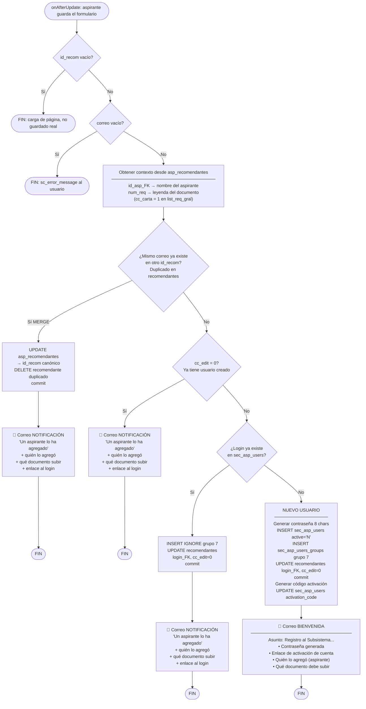

# Diagrama de flujo: `crear_usuario_recomendante`

Se ejecuta desde `onAfterUpdate` cada vez que un aspirante guarda el formulario de recomendantes.

---

## Diferencia entre los dos tipos de correo

| | Correo **BIENVENIDA** | Correo **NOTIFICACIÓN** |
|---|---|---|
| **Cuándo se envía** | Primera vez que se crea el usuario | Cada vez que un aspirante lo agrega y ya tiene usuario |
| **Asunto** | INECOL. Registro al Subsistema de Aspirantes al Posgrado | INECOL. Un aspirante lo ha agregado como recomendante |
| **Contraseña** | ✅ incluida | ❌ no incluye |
| **Enlace activación** | ✅ incluido | ❌ no incluye |
| **Enlace al login** | ❌ (aún no tiene cuenta activa) | ✅ incluido |
| **Quién lo agregó** | ✅ nombre del aspirante | ✅ nombre del aspirante |
| **Qué documento subir** | ✅ leyenda del requisito | ✅ leyenda del requisito |

---

## Casos en que se envía el correo NOTIFICACIÓN

1. **MERGE** (mismo correo en dos filas de `recomendantes`): se fusionan y se envía notificación al correo canónico.
2. **cc_edit = 0** (ya tenía usuario desde una guardada anterior): solo se notifica.
3. **Login ya existe en `sec_asp_users`** (el correo pertenece a otro rol, ej. aspirante): se asigna grupo y se notifica.

---

## Origen del contexto (aspirante + documento)

| Campo en el correo | Origen en BD |
|---|---|
| Nombre del recomendante | Parámetros del método: `$nombre`, `$apellido_p`, `$apellido_m` |
| Nombre del aspirante | `asp_recomendantes` (último id_asp_recom para este id_recom) → `aspirantes.nombres/ap_pat/ap_mat` |
| Documento a subir | `asp_recomendantes.num_req` → `sce.list_req_gral.leyenda` donde `cc_carta = 1` |

El contexto se obtiene **antes** del bloque MERGE para que la relación en `asp_recomendantes` aún tenga `id_recom_FK = id_recom_nuevo` (antes del UPDATE que lo redirige al canónico).
