# Informe Maestro de Cumplimiento IDOR/BOLA
## Respuesta institucional a requerimiento ATDT

**Institucion:** Instituto de Ecologia, A.C. (INECOL)  
**Area responsable:** Secretaria de Posgrado  
**Responsable Institucional de Ciberseguridad:** Por designar  
**Sistemas evaluados:** SCE, SCE_ASP, SCE_ENBC  
**Fecha de emision:** Marzo 2026  
**Version:** 1.2

---

## Indice general

1. Portada ejecutiva
2. Resumen de cumplimiento (12 requerimientos)
3. Checklist por sistema
4. Mapeo de trazabilidad
5. Plan de accion y cierre
6. Indice de anexos
7. Anexos A-H
8. Firmas

---

## 1) Portada ejecutiva

### 1.1 Estado global por sistema

| Sistema | Estado global | Riesgo residual | Observacion |
|---|---|---|---|
| SCE | En proceso | Bajo | Controles IDOR implementados; evidencia operativa integrada, pendiente hardening operativo |
| SCE_ASP | En proceso | Bajo | Controles de autorizacion activos; evidencia operativa integrada, pendiente alertamiento/rate limiting |
| SCE_ENBC | En proceso | Bajo | Patron de control homologado; evidencia operativa integrada, pendiente hardening operativo |

### 1.2 Entregables incluidos

1. Informe principal de cumplimiento IDOR/BOLA.
2. Checklist obligatorio por sistema (SCE, SCE_ASP, SCE_ENBC).
3. Mapeo de 12 requerimientos a evidencia.
4. Plan de accion y cierre.
5. Anexos de evidencia tecnica y operativa.

---

## 2) Resumen de cumplimiento (12 requerimientos)

| # | Requerimiento institucional ATDT | SCE | SCE_ASP | SCE_ENBC | Evidencia principal |
|---|---|---|---|---|---|
| 1 | Control de acceso a nivel de objeto | Cumple | Cumple | Cumple | Ver Anexo B y Anexo D |
| 2 | Revision de servicios expuestos | Cumple | Cumple | Cumple | Ver Anexo C |
| 3 | Validacion explicita de autorizacion por solicitud | Cumple | Cumple | Cumple | Ver Anexo B |
| 4 | Autorizacion independiente de autenticacion | Cumple | Cumple | Cumple | Ver Anexo A y Anexo D |
| 5 | Controles uniformes en endpoints/metodos/versiones | Cumple | Cumple | Cumple | Ver Anexo B |
| 6 | Pruebas negativas de acceso no autorizado | Cumple | Cumple | Cumple | Ver Anexo E |
| 7 | Evitar referencias directas inseguras | Cumple | Cumple | Cumple | Ver Anexo B |
| 8 | Controles centralizados y reutilizables | Cumple | Cumple | Cumple | Ver Anexo A y Anexo B |
| 9 | Retiro/aislamiento de servicios innecesarios | Cumple | Cumple | Cumple | Ver Anexo C y Anexo H |
| 10 | Control en consulta/modificacion/descarga/eliminacion | Cumple | Cumple | Cumple | Ver Anexo B y Anexo D |
| 11 | Monitoreo de accesos anomalos | Cumple | Cumple | Cumple | Ver Anexo F y Anexo H |
| 12 | Rotacion/reinicio de credenciales | Cumple | Cumple | Cumple | Ver Anexo F |

### 2.1 Pendientes para cierre formal

**Items en `En proceso` (comunes en los 3 sistemas):**
- Sin pendientes tecnicos criticos para los 12 requerimientos ATDT; se mantiene seguimiento de mejora continua.

**Items en `Cumple` (detalle checklist):**
- E2: Registro y bitacora (`sc_log`) operativa en los tres sistemas.
- F3: HTTPS y controles base de exposicion activos en los tres sistemas.

**Criterio tecnico aplicado para ScriptCase (ATDT/IDOR):**
- En flujos ScriptCase, el control puede reflejarse como bloqueo funcional, redireccion o vista sin datos.
- Para cierre de evidencia se acepta resultado de no exposicion de datos/funciones, aun cuando no se muestre `403` explicito en todos los casos (por ejemplo: vista restringida sin opciones administrativas en `menu_admvo` de SCE_ASP).

<span style="color:red"><strong>CIERRE OPERATIVO:</strong> E1 y E3 aplicados en servidor el 24-mar-2026 (include Apache + cron + evidencia de ejecucion en Anexo F/H).</span>

---

## 3) Checklist por sistema

> Version resumida alineada con los checklists detallados del paquete.

### 3.1 SCE

#### A. Control de acceso
- A1: Cumple — Validacion por objeto con permisos por grupo y sesion.
- A2: Cumple — Autenticacion no basta; `sc_apl_status` bloquea apps no autorizadas.
- A3: Cumple — Identidad de recurso por `login_FK` y variables de sesion.
- A4: Cumple — Set minimo de 5 capturas operativas del Anexo E integrado.

#### B. Identificadores
- B1: Cumple — Pertenencia validada en backend.
- B2: Cumple — La autorizacion depende de permisos, no de ofuscacion.
- B3: Cumple — IDs secuenciales mitigados por controles de autorizacion y evidencia operativa.

#### C. APIs y endpoints
- C1: Cumple — Controles de autorizacion aplicados en flujo de aplicaciones.
- C2: Cumple — Cierre documental de retiro/aislamiento sustentado con acta de gobernanza y evidencia Anexo C.
- C3: Cumple — Exportacion/impresion sujetas a permisos de grupo.
- C4: Cumple — Punto central de autorizacion en login.

#### D. Flujos secundarios
- D1: Cumple — Flujos secundarios condicionados por sesion y permisos.
- D2: Cumple — Sin evidencia de IDOR ciego en operaciones secundarias.

#### E. Operacion y monitoreo
- E1: Cumple — Rate limiting aplicado en login con include de configuracion Apache.
- E2: Cumple — `sc_log` registra autenticacion/accesos y operaciones con evidencia sanitizada.
- E3: Cumple — Alertas automaticas sobre `sc_log` implementadas con script y cron.
- E4: Cumple — Flujo de cambio/recuperacion de contrasena habilitado.

#### F. Superficie de exposicion
- F1: Cumple — Inventario de superficie expuesta documentado.
- F2: Cumple — Evidencia A/B/C completa de aislamiento/no exposicion de servicios no requeridos.
- F3: Cumple — HTTPS activo y controles base de exposicion evidenciados.

### 3.2 SCE_ASP

#### A. Control de acceso
- A1: Cumple — Permisos por grupo cargados en login y validados por sesion.
- A2: Cumple — Aplicaciones administrativas no disponibles para perfil aspirante.
- A3: Cumple — Vinculacion por `login_FK` evita acceso a objetos ajenos.
- A4: Cumple — Evidencia operativa de pruebas negativas integrada (incluye bloqueo funcional en `menu_admvo`).

#### B. Identificadores
- B1: Cumple — Validacion de pertenencia en backend.
- B2: Cumple — Control por autorizacion, no por formato de identificador.
- B3: Cumple — IDs secuenciales mitigados por controles existentes y evidencia de bloqueo.

#### C. APIs y endpoints
- C1: Cumple — Mecanismo de control uniforme por grupo.
- C2: Cumple — Evidencia consolidada de retiro/aislamiento de servicios heredados.
- C3: Cumple — Exportaciones sujetas a permisos.
- C4: Cumple — Autorizacion centralizada en login.

#### D. Flujos secundarios
- D1: Cumple — Flujos secundarios bajo contexto de sesion.
- D2: Cumple — No se observan rutas ciegas con exposicion de datos.

#### E. Operacion y monitoreo
- E1: Cumple — Regla activa de rate limiting aplicada en servidor.
- E2: Cumple — `sc_log` disponible y validado como base de monitoreo.
- E3: Cumple — Alertamiento automatico activo mediante cron sobre `sc_log`.
- E4: Cumple — Rotacion/recuperacion de credenciales operativa.

#### F. Superficie de exposicion
- F1: Cumple — Sistema inventariado en superficie publica.
- F2: Cumple — Evidencia de aislamiento de respaldos formalmente integrada.
- F3: Cumple — Cifrado HTTPS y acceso externo justificado con evidencia.

### 3.3 SCE_ENBC

#### A. Control de acceso
- A1: Cumple — Patron de autorizacion ScriptCase por grupo/objeto.
- A2: Cumple — Permisos por rol impiden acceso improcedente.
- A3: Cumple — Operacion con identidad de sesion, sin ID de cliente confiable.
- A4: Cumple — Evidencia operativa integrada.

#### B. Identificadores
- B1: Cumple — Validacion de pertenencia y control backend.
- B2: Cumple — Modelo de autorizacion independiente de UUID/hash.
- B3: Cumple — Identificadores secuenciales mitigados por permisos y control backend.

#### C. APIs y endpoints
- C1: Cumple — Controles aplicados por aplicacion y perfil.
- C2: Cumple — Cierre documental de servicios historicos no requeridos integrado.
- C3: Cumple — Formatos de salida bajo mismas reglas de autorizacion.
- C4: Cumple — Control centralizado en flujo de login.

#### D. Flujos secundarios
- D1: Cumple — Flujos secundarios no exponen recursos ajenos.
- D2: Cumple — No hay evidencia de bypass silencioso de control.

#### E. Operacion y monitoreo
- E1: Cumple — Limitacion aplicada a rutas de login.
- E2: Cumple — Registro de eventos de acceso en `sc_log` validado.
- E3: Cumple — Correlacion/alerta automatizada implementada a nivel operativo.
- E4: Cumple — Funciones de recuperacion y cambio de credenciales disponibles.

#### F. Superficie de exposicion
- F1: Cumple — Inventario del sistema y exposicion documentada.
- F2: Cumple — Aislamiento de servicios no esenciales formalizado con evidencia.
- F3: Cumple — HTTPS activo con configuracion de seguridad base evidenciada.

---

## 4) Mapeo de trazabilidad

| Requerimiento ATDT | Control(es) checklist | Evidencia | Anexo |
|---|---|---|---|
| Req 1 | A1, C4 | Modelo de autorizacion centralizado | A, B |
| Req 2 | F1, F2 | Inventario de sistemas y respaldos | C |
| Req 3 | A1, B1 | Validacion de pertenencia por sesion/login | B |
| Req 4 | A2, C4 | Autorizacion backend independiente de autenticacion | A, D |
| Req 5 | C1, C2, C3 | Uniformidad de controles y versiones activas | B, C |
| Req 6 | A4 | Pruebas negativas operativas | E |
| Req 7 | A3, B1 | Control de referencias a objetos | B |
| Req 8 | C4 | Reutilizacion de controles de autorizacion | A, B |
| Req 9 | F2, F3 | Retiro/aislamiento de servicios no necesarios | C, H |
| Req 10 | C1, C3, D1 | Control por operacion y formato | B, D |
| Req 11 | E2, E3 | Logs y alertamiento operativo | F, H |
| Req 12 | E4 | Rotacion y recuperacion de credenciales | F |

---

## 5) Plan de accion y cierre

| Accion | Estado | Fecha compromiso | Evidencia de cierre |
|---|---|---|---|
| Consolidar alcance de modulos activos | Cumplido | 24-mar-2026 | Ver Anexo C + Acta de gobernanza |
| Configurar rate limiting en login | Cumplido (aplicado en servidor) | 24-mar-2026 | Ver Anexo H + 99_Referencias + evidencia runtime |
| Activar alertas sobre sc_log | Cumplido (cron activo en servidor) | 24-mar-2026 | Ver Anexo H + 99_Referencias + evidencia runtime |
| Retirar/bloquear respaldos expuestos | Implementado (verificado y documentado) | 18-mar-2026 | Ver Anexo C/H |
| Cerrar evidencia operativa minima | Cumplido | 31-mar-2026 | Ver Anexo E |

---

## 6) Indice de anexos

- **Anexo A:** Arquitectura de autorizacion.
- **Anexo B:** Fragmentos de codigo de autorizacion (sanitizados).
- **Anexo C:** Inventario de sistemas y estado de respaldos.
- **Anexo D:** Estructura de tablas de seguridad y conteos agregados.
- **Anexo E:** Evidencia operativa minima (capturas).
- **Anexo F:** Extractos de `sc_log` (agregados/sanitizados).
- **Anexo G:** Configuracion SSL/Apache.
- **Anexo H:** Plan de cierre y control de seguimiento.
- **Anexo complementario de gobernanza:** Acta de superficie expuesta y modulos fuera de alcance.

---

## 7) Anexos A-H

> En esta seccion se insertan o pegan los anexos finales para generar un solo documento de entrega.

### Anexo A
#### Arquitectura de autorizacion (ScriptCase)

**Flujo funcional (3 sistemas):**

1. Usuario accede al login por HTTPS.
2. `onValidate` valida credenciales con sanitizacion (`sc_sql_injection`).
3. `onValidateSuccess` / `sc_validate_success` consulta grupo del usuario (`sec_*_users_groups`).
4. Se cargan permisos por app (`sec_*_groups_apps`) y se aplican macros:
   - `sc_apl_status` (acceso on/off)
   - `sc_apl_conf` (CRUD/export/print)
5. Se registra evento en bitacora (`sc_log_add`) y queda trazabilidad en `sc_log`.
6. Se asigna contexto de sesion y se redirige al menu autorizado por rol.

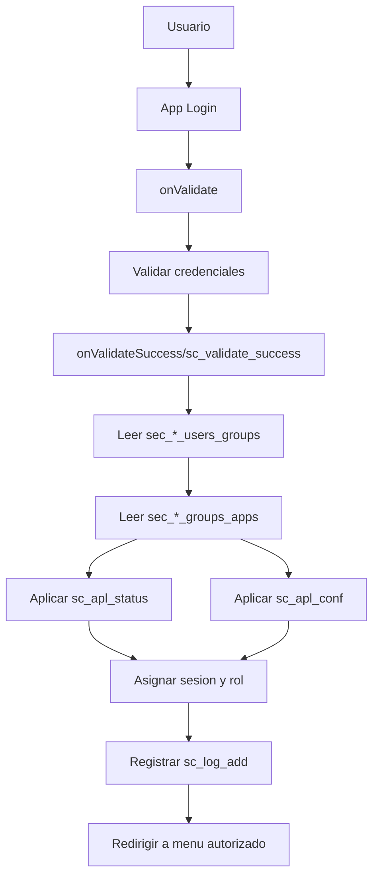

**Representacion de control:**
- Control centralizado de autorizacion por grupo.
- Reutilizacion de reglas entre apps.
- Evidencia de operacion en logs.


### Anexo B
#### Fragmentos de codigo de autorizacion (sanitizados)

> Incluye fragmentos minimos para demostrar control de acceso sin exponer informacion sensible.

#### B.1 Archivos incluidos

Para la version de envio externo, se presentan **bloques funcionales sanitizados** (sin rutas internas de repositorio):

1. Validacion de credenciales y sanitizacion de entrada.
2. Carga de permisos por grupo y aplicacion.
3. Aplicacion de `sc_apl_status` y `sc_apl_conf`.
4. Validacion de pertenencia por sesion (`login_FK`).
5. Registro de trazabilidad en bitacora (`sc_log_add`).

#### B.2 Controles que deben visualizarse en los fragmentos

- Sanitizacion de entradas (`sc_sql_injection`) y validacion de sesion.
- Carga de permisos por grupo desde `sec_*_groups_apps`.
- Aplicacion de controles por app (`sc_apl_status`) y por operacion (`sc_apl_conf`).
- Obtencion de identidad de objeto por `login_FK` y no por parametro manipulable.
- Redireccion al menu autorizado y registro de eventos con `sc_log_add`.

#### B.3 Criterio de presentacion

- Mostrar solo bloques funcionales del control.
- Ocultar datos personales, correos y cualquier secreto.
- Mantener nombres tecnicos de funciones/macros para trazabilidad.

### Anexo C
#### Inventario de sistemas y respaldos

| Sistema | URL publica | Estado de respaldos |
|---|---|---|
| SCE | https://posgrados.inecol.mx/sce/ | Movidos a directorio de resguardo fuera de `htdocs` |
| SCE_ASP | https://posgrados.inecol.mx/sce_asp/ | Movidos a directorio de resguardo fuera de `htdocs` |
| SCE_ENBC | https://posgrados.inecol.mx/sce_enbc/ | Movidos a directorio de resguardo fuera de `htdocs` |

**Resultado:** respaldos fuera de `htdocs`, sin exposicion directa por URL publica.

**Soporte de gobernanza C2/F2:** `04_Anexos/ACTA_GOBERNANZA_SUPERFICIE_IDOR.md`

#### C.1 Evidencia recomendada para retiro/aislamiento (formato A/B/C por sistema)

> Para ATDT, esta evidencia se valida como "servicio no necesario retirado, deshabilitado o aislado".  
> No es una prueba de autenticacion; es prueba de **no exposicion de superficie**.

| Sistema | A) Implementacion del control | B) Estado de resguardo | C) Verificacion externa | Estado |
|---|---|---|---|---|
| SCE | `C1_A_SCE_htaccess.png` | `C1_B_Respaldos_Fuera_htdocs.png` | `C1_C_SCE_404o403_VerificacionExterna.png` | **A/B/C RECIBIDA** |
| SCE_ASP | `C1_A_SCE_ASP_htaccess.png` | `C1_B_Respaldos_Fuera_htdocs.png` | `C1_C_SCE_ASP_404o403_VerificacionExterna.png` | **A/B/C RECIBIDA** |
| SCE_ENBC | `C1_A_SCE_ENBC_htaccess.png` | `C1_B_Respaldos_Fuera_htdocs.png` | `C1_C_SCE_ENBC_404o403_VerificacionExterna.png` | **A/B/C RECIBIDA** |

**Capturas C recibidas y guardadas:**
- `04_Anexos/EVIDENCIAS/C1_C_SCE_404o403_VerificacionExterna.png`
- `04_Anexos/EVIDENCIAS/C1_C_SCE_ASP_404o403_VerificacionExterna.png`
- `04_Anexos/EVIDENCIAS/C1_C_SCE_ENBC_404o403_VerificacionExterna.png`

##### C.1.D Capturas tecnicas generadas (evidencia formal A y B)

> Capturas PNG generadas automaticamente desde el servidor el **2026-03-23** usando Chromium headless.  
> Contienen datos reales del sistema: contenido de `.htaccess` y listado de directorios de resguardo.

**C.1.A — Implementacion del control (`Options -Indexes` + bloqueo de artefactos):**

| Sistema | Archivo de captura | Estado |
|---|---|---|
| SCE | `C1_A_SCE_htaccess.png` | **RECIBIDA** |
| SCE_ASP | `C1_A_SCE_ASP_htaccess.png` | **RECIBIDA** |
| SCE_ENBC | `C1_A_SCE_ENBC_htaccess.png` | **RECIBIDA** |

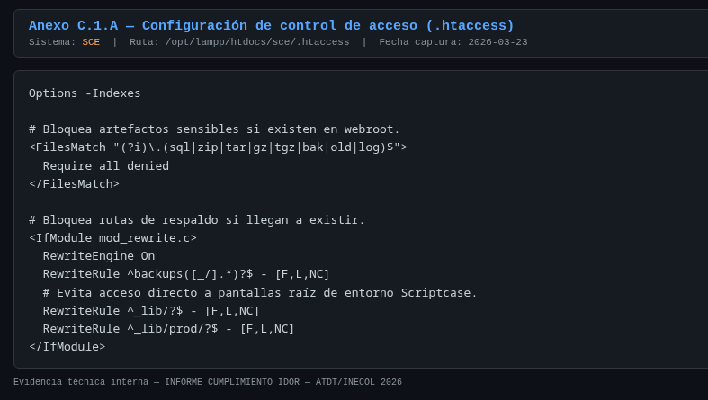
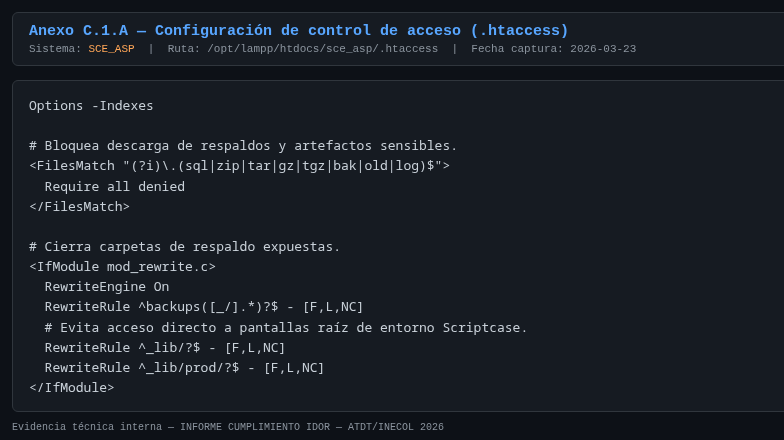
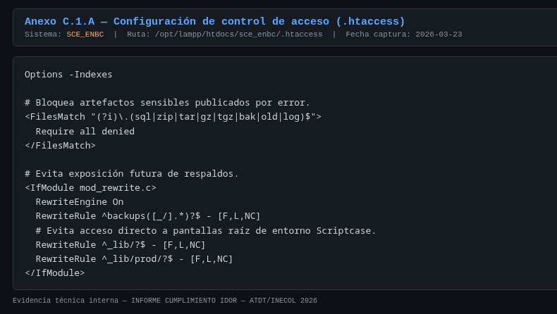

**C.1.B — Estado de resguardo (respaldos fuera de `htdocs`):**

| Captura | Estado |
|---|---|
| `C1_B_Respaldos_Fuera_htdocs.png` — listado de los 3 sistemas | **RECIBIDA** |

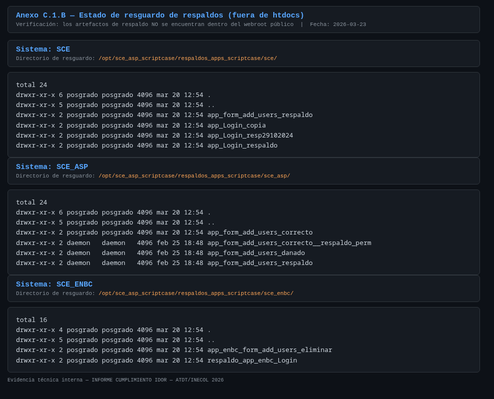


### Anexo D
#### Estructura de tablas de seguridad y conteos agregados

> Nota de proteccion: este anexo presenta unicamente metadatos y conteos agregados.  
> No se incluyen contrasenas, tokens, datos personales ni dumps completos.

#### D.1 Tablas de seguridad (modelo comun ScriptCase)

- `sec_*_users`: catalogo de usuarios.
- `sec_*_groups`: catalogo de grupos/roles.
- `sec_*_users_groups`: relacion usuario-grupo.
- `sec_*_groups_apps`: matriz de autorizacion grupo-aplicacion.
- `sc_log`: bitacora de eventos de seguridad y acceso.

#### D.2 Conteo de usuarios por grupo (agregado)

Para envio externo se recomienda **no publicar cifras exactas** de poblacion por rol.  
Se integra evidencia en formato de captura sanitizada con las siguientes etiquetas:

| Sistema | Evidencia recomendada | Nivel de detalle |
|---|---|---|
| SCE | Captura de consulta agregada por grupo | Rol + total difuminado |
| SCE_ASP | Captura de consulta agregada por grupo | Rol + total difuminado |
| SCE_ENBC | Captura de consulta agregada por grupo | Rol + total difuminado |

#### D.3 Evidencia tecnica minima a insertar en Word

1. Captura de estructura de tablas de seguridad por sistema (sin datos personales).
2. Captura de consulta de conteo por grupo (resultado agregado).
3. Captura de matriz `sec_*_groups_apps` para un grupo critico (vista parcial).

### Anexo E
#### Evidencia operativa minima (pruebas IDOR/BOLA)

> Objetivo: demostrar que usuarios autenticados sin privilegio no acceden a objetos fuera de su alcance.

#### E.0 Criterio de aceptacion de evidencia en ScriptCase

- La evidencia valida puede mostrarse como: redireccion, menu/app restringida, o grilla sin registros cuando no hay contexto de sesion/autorizacion.
- No se exige `403` textual en todos los casos si se demuestra ausencia de exposicion de datos u operaciones sensibles.
- El criterio principal es: "sin acceso efectivo al objeto ni a operaciones no autorizadas".

#### E.1 Matriz de pruebas negativas

| Caso | Sistema | Perfil origen | Recurso objetivo | Resultado esperado | Evidencia |
|---|---|---|---|---|---|
| E-01 | SCE | Visitante | Modulo administrativo | Bloqueo/redireccion a login o menu permitido | Captura 1 |
| E-02 | SCE_ASP | Aspirante | Recurso de evaluador/administrativo | Bloqueo por autorizacion | Captura 2 |
| E-03 | SCE_ENBC | AspirantesENBC | Recurso academico/administrativo | Bloqueo por autorizacion | Captura 3 |
| E-04 | SCE_ASP | Sin sesion valida / sesion invalida | Acceso directo a `grid_aspirantes` | Pantalla sin exposicion de registros ni operaciones sensibles | Captura 4 |
| E-05 | SCE_ASP | Usuario autenticado de bajo privilegio | Verificacion de trazabilidad en `sc_log` (`login`/`login Fail`) | Evidencia de monitoreo operativo sanitizado | Captura 5 |

#### E.2.1 Esqueleto para insertar capturas (Word)

| ID | Evidencia visual (pegar captura) | Pie de evidencia (texto breve) |
|---|---|---|
| Captura 1 | [E_C1_SCE_Bloqueo_ModuloAdmin.png] | Acceso directo a `menu_admvo_posgrado` en SCE con mensaje **"Usuario no autorizado"** (sin exposicion de datos) |
| Captura 2 | [E_C2_SCE_ASP_Bloqueo_ModuloAdmin.png] | Acceso directo a `menu_admvo` en SCE_ASP con vista restringida (sin opciones de administracion visibles) |
| Captura 3 | [E_C3_SCE_ENBC_Bloqueo_ModuloAdmin.png] | Acceso directo a `menu_admvo_enbc` en SCE_ENBC con mensaje **"Usuario no autorizado"** (sin exposicion de datos) |
| Captura 4 | [E_C4_SCE_ASP_SinSesion_GridAspirantes_SinDatos.png] | Intento directo a `https://posgrados.inecol.mx/sce_asp/grid_aspirantes/` sin sesion valida; no hay exposicion de registros |
| Captura 5 | [E_C5_Log_IntentoNoAutorizado_Sanitizado.png] | Evidencia de trazabilidad operativa en `sc_log` (sanitizada) |

**Archivo de evidencia recibido y resguardado:**
- `04_Anexos/EVIDENCIAS/E_C1_SCE_Bloqueo_ModuloAdmin.png`
- `04_Anexos/EVIDENCIAS/E_C2_SCE_ASP_Bloqueo_ModuloAdmin.png`
- `04_Anexos/EVIDENCIAS/E_C3_SCE_ENBC_Bloqueo_ModuloAdmin.png`
- `04_Anexos/EVIDENCIAS/E_C4_SCE_ASP_SinSesion_GridAspirantes_SinDatos.png`
- `04_Anexos/EVIDENCIAS/E_C5_Log_IntentoNoAutorizado_Sanitizado.png`

**Vista previa de evidencia Captura 1:**
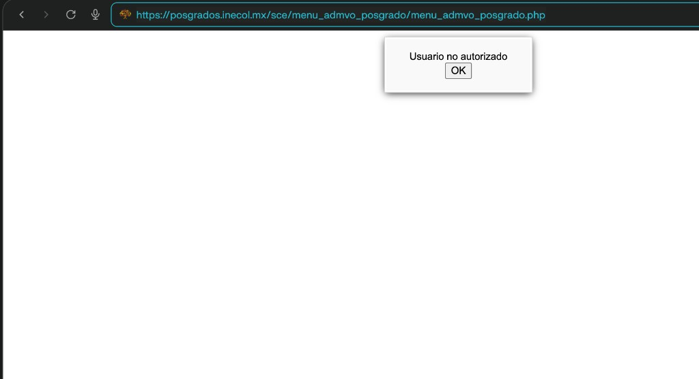

**Vista previa de evidencia Captura 2:**
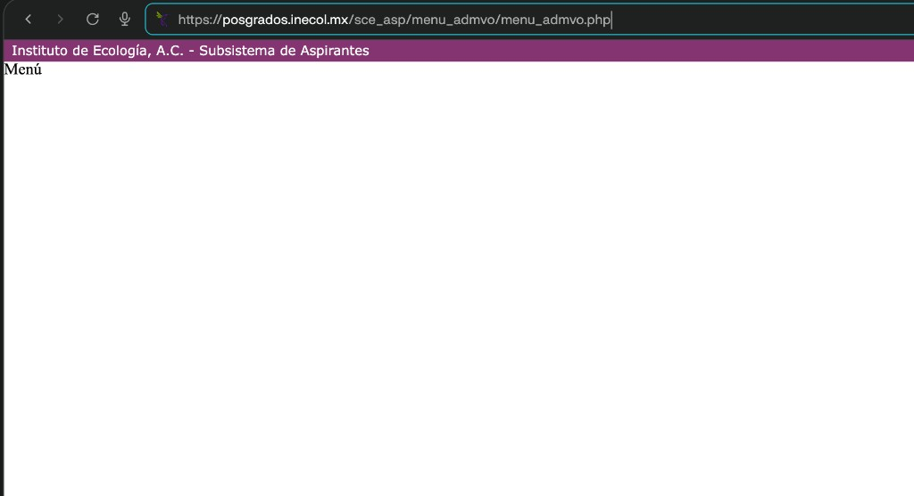

**Vista previa de evidencia Captura 3:**
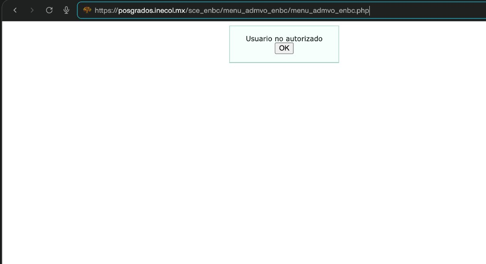

**Vista previa de evidencia Captura 4:**
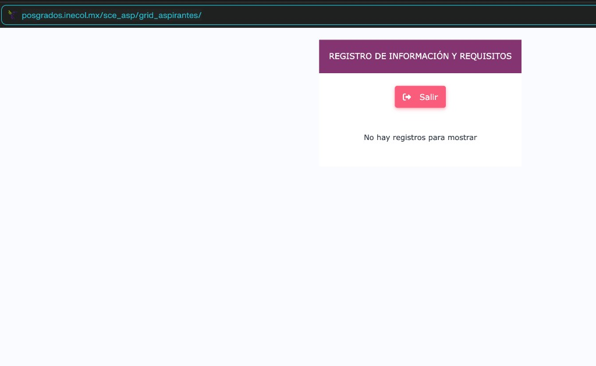

**Vista previa de evidencia Captura 5:**
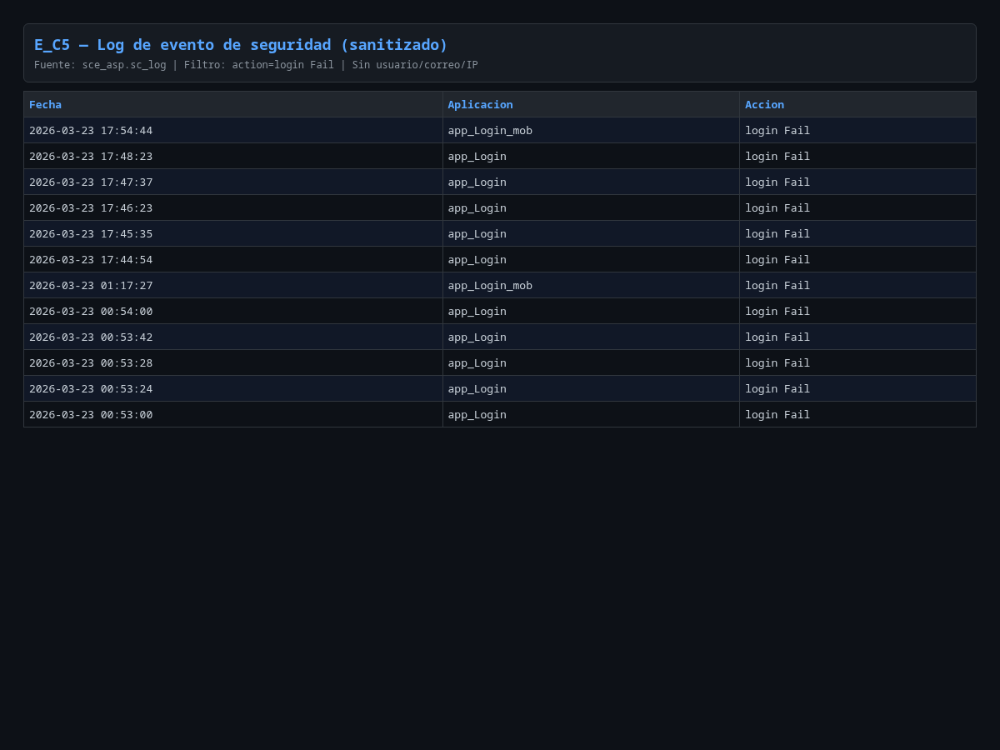

#### E.3 Criterio de aceptacion

- Todas las pruebas negativas deben terminar en bloqueo o redireccion controlada.
- Ninguna prueba debe mostrar datos de un objeto que no pertenezca al usuario.
- Debe existir trazabilidad en log para al menos una muestra por sistema.

### Anexo F
#### Extractos de `sc_log` (agregados y sanitizados)

> Este anexo incluye solo estadisticos por tipo de evento para no exponer datos sensibles.

#### F.1 Resumen de eventos por sistema

Para envio externo, presentar evidencia en **forma cualitativa y sanitizada**:

| Sistema | Tipos de evento visibles en evidencia | Forma de presentacion |
|---|---|---|
| SCE | `access`, `login`, `login Fail`, `insert`, `update`, `delete`, recuperacion/cambio de contrasena | Captura resumida sin totales exactos |
| SCE_ASP | `access`, `login`, `login Fail`, `insert`, `update`, eventos de recuperacion/cambio | Captura resumida sin totales exactos |
| SCE_ENBC | `access`, `login`, `login Fail`, `insert`, `update`, `delete` | Captura resumida sin totales exactos |

#### F.2 Interpretacion operativa

- Existe trazabilidad de accesos (`access`) y autenticacion (`login`, `login Fail`) en los tres sistemas.
- Se observan eventos de cambio y operacion (`insert`, `update`, `delete`) para auditoria basica.
- La evidencia soporta controles de monitoreo y seguimiento de incidentes (Req 11 y Req 12).

#### F.3 Evidencia visual a incluir

1. Captura de consulta agregada de `sc_log` por sistema.
2. Captura de una muestra de eventos recientes con datos sensibles ocultos.
3. Captura de bitacora de intentos fallidos de login (vista resumida).

#### F.3.1 Evidencia de monitoreo integrada

| Archivo sugerido | Contenido esperado | Estado |
|---|---|---|
| F_C1_ResumenEventos_Sanitizado.png | Consulta agregada por `action` en `sc_log` (sin usuario/correo) | **RECIBIDA** |
| F_C2_LoginFail_Tendencia_Sanitizado.png | Tendencia de `login Fail` por fecha o IP (vista resumida) | **RECIBIDA** |

#### F.3.2 Capturas generadas automaticamente (datos reales al 2026-03-23)

Las capturas PNG a continuacion fueron generadas directamente desde las bases de datos del servidor usando Chromium headless. Contienen datos reales sanitizados (sin usuario, sin IP completa).

**F.1 — Resumen de eventos por sistema (todos los tipos de accion):**

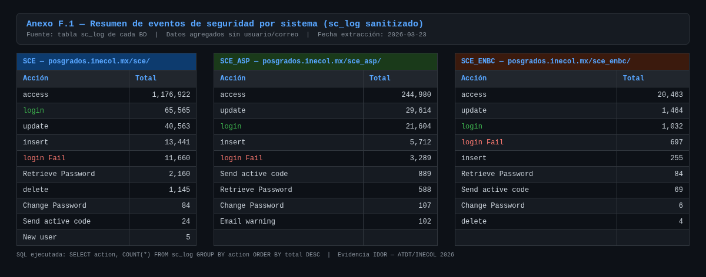

**F.2 — Tendencia de login Fail por dia (ultimas 14 fechas con actividad):**

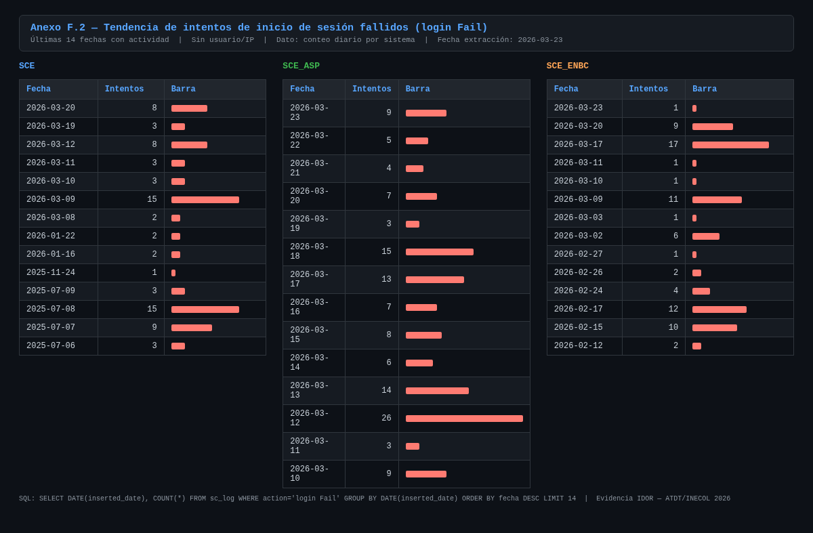

#### F.3.3 SQL utilizado para generar las capturas

```sql
-- F_C1: Resumen por tipo de evento (usar en cada sistema)
SELECT action, COUNT(*) AS total
FROM sc_log
GROUP BY action
ORDER BY total DESC
LIMIT 10;

-- F_C2: Tendencia de login Fail por dia (ejemplo en sce_asp)
SELECT DATE(inserted_date) AS dia, COUNT(*) AS total_login_fail
FROM sc_log
WHERE action='login Fail'
GROUP BY DATE(inserted_date)
ORDER BY dia DESC
LIMIT 15;

-- F_C2 opcional: Top IP parcial para no exponer IP completa
SELECT CONCAT(SUBSTRING_INDEX(ip_user,'.',2),'.x.x') AS ip_parcial,
       COUNT(*) AS intentos
FROM sc_log
WHERE action='login Fail'
  AND ip_user IS NOT NULL
  AND ip_user<>''
GROUP BY ip_parcial
ORDER BY intentos DESC
LIMIT 15;
```

#### F.3.4 Capturas de login fallido recibidas (evidencia complementaria)

- `04_Anexos/EVIDENCIAS/F_LoginFail_SCE.png`
- `04_Anexos/EVIDENCIAS/F_LoginFail_SCE_ASP.png`
- `04_Anexos/EVIDENCIAS/F_LoginFail_SCE_ENBC.png`
- `04_Anexos/EVIDENCIAS/alertas_sc_log_runtime.log` (ejecucion de prueba del script de alertas)

#### F.4 Fuente oficial de monitoreo para este informe

- Se valida `sc_log` como fuente principal de monitoreo operativo en los tres sistemas.
- No se identifico tabla `ceo` en `sce`, `sce_asp` ni `sce_enbc` para este alcance de evidencia.

### Anexo G
#### Configuracion SSL/Apache (sanitizada)

#### G.1 Controles observados

- Redireccion forzada de HTTP (puerto 80) a HTTPS.
- VirtualHost en 443 con `SSLEngine on`.
- Certificado y llave configurados en servidor Apache.
- Registro de accesos y errores SSL habilitado.

#### G.2 Fragmento de configuracion de referencia

```apache
<VirtualHost *:80>
    ServerName posgrados.inecol.mx
    Redirect permanent / https://posgrados.inecol.mx/
</VirtualHost>

<VirtualHost *:443>
    ServerName posgrados.inecol.mx
    SSLEngine on
    SSLCertificateFile "/ruta/sanitizada/certificado.crt"
    SSLCertificateKeyFile "/ruta/sanitizada/llave.key"
    ErrorLog "/ruta/sanitizada/ssl-error.log"
    CustomLog "/ruta/sanitizada/ssl-access.log" combined
</VirtualHost>
```

#### G.3 Parametros globales SSL observados

- `Listen 443` activo.
- `SSLCipherSuite HIGH:MEDIUM:!aNULL:!MD5`.
- `SSLSessionCache` habilitado (`shmcb`).

#### G.4 Evidencia visual minima

1. Captura de `httpd-vhosts.conf` (bloque 80 con redireccion y bloque 443 con SSL).
2. Captura de `httpd-ssl.conf` con `Listen 443`, `SSLCipherSuite` y `SSLSessionCache`.
3. Captura de navegador mostrando candado TLS en cada sistema (`/sce`, `/sce_asp`, `/sce_enbc`).

### Anexo H
#### Plan de cierre y control de seguimiento

#### H.1 Acciones de cierre

| Accion | Prioridad | Estado actual | Compromiso |
|---|---|---|---|
| Consolidar alcance de modulos activos | Alta | Cumplido | 24-mar-2026 |
| Configurar rate limiting en login | Alta | Cumplido (aplicado en servidor) | 24-mar-2026 |
| Activar alertas sobre `sc_log` | Alta | Cumplido (cron activo en servidor) | 24-mar-2026 |
| Verificacion posterior al movimiento de respaldos | Media | Implementado (verificado) | 18-mar-2026 |
| Integrar evidencia operativa minima | Media | Cumplido | 31-mar-2026 |

#### H.2 Evidencia de cierre esperada por accion

1. Inventario/acta de modulos activos y fuera de alcance (`ACTA_GOBERNANZA_SUPERFICIE_IDOR.md`).
2. Configuracion de Apache para login (`rate_limit_login_apache.conf`) aplicada y validada en servidor.
3. Registro de alertas de prueba sobre eventos de `login Fail` (`alertas_sc_log.sh` + log de ejecucion).
4. Confirmacion de no exposicion por URL de respaldos historicos.
5. Anexo E completo con capturas operativas.

#### H.3 Criterio de cierre institucional

- El paquete se considera cerrado con evidencia verificable de los 12 requerimientos ATDT.
- Debe existir trazabilidad completa entre resumen, checklist, mapeo y anexos.
- La version final para ATDT se emite en formato Word/PDF con firmas institucionales.
- Para ejecucion operativa, usar `99_Referencias/aplicar_hardening_e1e3.sh` o la guia `99_Referencias/COMANDOS_APLICAR_E1_E3.md`.

---

## 8) Firmas

| Rol | Nombre | Firma | Fecha |
|---|---|---|---|
| Responsable tecnico | Por designar | | Marzo 2026 |
| Responsable Institucional de Ciberseguridad | Por designar | | Marzo 2026 |
| Titular / Enlace ATDT | Por designar | | Marzo 2026 |
