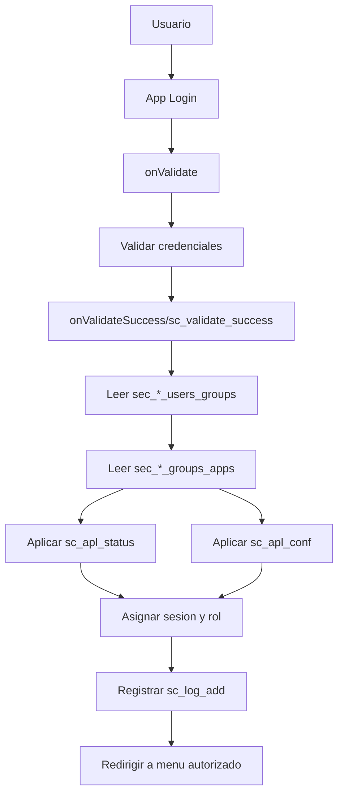

# Informe Maestro de Cumplimiento IDOR/BOLA
## Respuesta institucional a requerimiento ATDT

**Institucion:** Instituto de Ecologia, A.C. (INECOL)  
**Area responsable:** Secretaria de Posgrado  
**Responsable Institucional de Ciberseguridad:** Por designar  
**Sistemas evaluados:** SCE, SCE_ASP, SCE_ENBC  
**Fecha de emision:** Marzo 2026  
**Version:** 1.2

---

## Indice general

1. Portada ejecutiva
2. Resumen de cumplimiento (12 requerimientos)
3. Checklist por sistema
4. Mapeo de trazabilidad
5. Plan de accion y cierre
6. Indice de anexos
7. Anexos A-H
8. Firmas

---

## 1) Portada ejecutiva

### 1.1 Estado global por sistema

| Sistema | Estado global | Riesgo residual | Observacion |
|---|---|---|---|
| SCE | En proceso | Bajo | Controles IDOR implementados; pendiente evidencia operativa y monitoreo avanzado |
| SCE_ASP | En proceso | Bajo | Controles de autorizacion activos; pendiente cierre de pruebas negativas y alertamiento |
| SCE_ENBC | En proceso | Bajo | Patron de control homologado; pendiente cierre formal de evidencia operativa |

### 1.2 Entregables incluidos

1. Informe principal de cumplimiento IDOR/BOLA.
2. Checklist obligatorio por sistema (SCE, SCE_ASP, SCE_ENBC).
3. Mapeo de 12 requerimientos a evidencia.
4. Plan de accion y cierre.
5. Anexos de evidencia tecnica y operativa.

---

## 2) Resumen de cumplimiento (12 requerimientos)

| # | Requerimiento institucional ATDT | SCE | SCE_ASP | SCE_ENBC | Evidencia principal |
|---|---|---|---|---|---|
| 1 | Control de acceso a nivel de objeto | Cumple | Cumple | Cumple | Ver Anexo B y Anexo D |
| 2 | Revision de servicios expuestos | Cumple | Cumple | Cumple | Ver Anexo C |
| 3 | Validacion explicita de autorizacion por solicitud | Cumple | Cumple | Cumple | Ver Anexo B |
| 4 | Autorizacion independiente de autenticacion | Cumple | Cumple | Cumple | Ver Anexo A y Anexo D |
| 5 | Controles uniformes en endpoints/metodos/versiones | Cumple | Cumple | Cumple | Ver Anexo B |
| 6 | Pruebas negativas de acceso no autorizado | En proceso | En proceso | En proceso | Ver Anexo E |
| 7 | Evitar referencias directas inseguras | Cumple | Cumple | Cumple | Ver Anexo B |
| 8 | Controles centralizados y reutilizables | Cumple | Cumple | Cumple | Ver Anexo A y Anexo B |
| 9 | Retiro/aislamiento de servicios innecesarios | En proceso | En proceso | En proceso | Ver Anexo C y Anexo H |
| 10 | Control en consulta/modificacion/descarga/eliminacion | Cumple | Cumple | Cumple | Ver Anexo B y Anexo D |
| 11 | Monitoreo de accesos anomalos | En proceso | En proceso | En proceso | Ver Anexo F y Anexo H |
| 12 | Rotacion/reinicio de credenciales | Cumple | Cumple | Cumple | Ver Anexo F |

### 2.1 Pendientes para cierre formal

**Items en `En proceso` (comunes en los 3 sistemas):**
- Req 6: Pruebas negativas de acceso no autorizado (evidencia operativa).
- Req 9: Retiro/aislamiento de servicios no necesarios (cierre documental final).
- Req 11: Monitoreo de accesos anomalos (alertamiento automatico).

**Items en `Cumple (parcial)` (detalle checklist):**
- E2: Registro y bitacora (`sc_log`) disponible, pendiente robustecer cobertura de eventos bloqueados.
- F3: HTTPS y controles base activos, pendiente madurez operativa adicional.

---

## 3) Checklist por sistema

> Version resumida alineada con los checklists detallados del paquete.

### 3.1 SCE

#### A. Control de acceso
- A1: Cumple — Validacion por objeto con permisos por grupo y sesion.
- A2: Cumple — Autenticacion no basta; `sc_apl_status` bloquea apps no autorizadas.
- A3: Cumple — Identidad de recurso por `login_FK` y variables de sesion.
- A4: En proceso — Pendiente integrar set minimo de 5 capturas operativas del Anexo E.

#### B. Identificadores
- B1: Cumple — Pertenencia validada en backend.
- B2: Cumple — La autorizacion depende de permisos, no de ofuscacion.
- B3: En proceso — IDs secuenciales mitigados; documentar evidencia final.

#### C. APIs y endpoints
- C1: Cumple — Controles de autorizacion aplicados en flujo de aplicaciones.
- C2: En proceso — Cierre documental de retiro/aislamiento de servicios historicos.
- C3: Cumple — Exportacion/impresion sujetas a permisos de grupo.
- C4: Cumple — Punto central de autorizacion en login.

#### D. Flujos secundarios
- D1: Cumple — Flujos secundarios condicionados por sesion y permisos.
- D2: Cumple — Sin evidencia de IDOR ciego en operaciones secundarias.

#### E. Operacion y monitoreo
- E1: En proceso — Falta configurar rate limiting especifico en login.
- E2: Cumple (parcial) — `sc_log` registra autenticacion/accesos y operaciones.
- E3: En proceso — Falta automatizar alertas por patrones anomalos.
- E4: Cumple — Flujo de cambio/recuperacion de contrasena habilitado.

#### F. Superficie de exposicion
- F1: Cumple — Inventario de superficie expuesta documentado.
- F2: En proceso — Formalizar evidencia final de aislamiento de servicios no requeridos.
- F3: Cumple (parcial) — HTTPS activo y controles base de exposicion.

### 3.2 SCE_ASP

#### A. Control de acceso
- A1: Cumple — Permisos por grupo cargados en login y validados por sesion.
- A2: Cumple — Aplicaciones administrativas no disponibles para perfil aspirante.
- A3: Cumple — Vinculacion por `login_FK` evita acceso a objetos ajenos.
- A4: En proceso — Integrar evidencia operativa de pruebas negativas.

#### B. Identificadores
- B1: Cumple — Validacion de pertenencia en backend.
- B2: Cumple — Control por autorizacion, no por formato de identificador.
- B3: En proceso — IDs secuenciales mitigados por controles existentes.

#### C. APIs y endpoints
- C1: Cumple — Mecanismo de control uniforme por grupo.
- C2: En proceso — Consolidar evidencia de retiro/aislamiento de servicios heredados.
- C3: Cumple — Exportaciones sujetas a permisos.
- C4: Cumple — Autorizacion centralizada en login.

#### D. Flujos secundarios
- D1: Cumple — Flujos secundarios bajo contexto de sesion.
- D2: Cumple — No se observan rutas ciegas con exposicion de datos.

#### E. Operacion y monitoreo
- E1: En proceso — Pendiente regla activa de rate limiting.
- E2: Cumple (parcial) — `sc_log` disponible como base de monitoreo.
- E3: En proceso — Pendiente alertamiento automatico.
- E4: Cumple — Rotacion/recuperacion de credenciales operativa.

#### F. Superficie de exposicion
- F1: Cumple — Sistema inventariado en superficie publica.
- F2: En proceso — Cerrar formalmente evidencia de aislamiento de respaldos.
- F3: Cumple (parcial) — Cifrado HTTPS y acceso externo justificado.

### 3.3 SCE_ENBC

#### A. Control de acceso
- A1: Cumple — Patron de autorizacion ScriptCase por grupo/objeto.
- A2: Cumple — Permisos por rol impiden acceso improcedente.
- A3: Cumple — Operacion con identidad de sesion, sin ID de cliente confiable.
- A4: En proceso — Integracion final de evidencia operativa.

#### B. Identificadores
- B1: Cumple — Validacion de pertenencia y control backend.
- B2: Cumple — Modelo de autorizacion independiente de UUID/hash.
- B3: En proceso — Identificadores secuenciales con mitigacion por permisos.

#### C. APIs y endpoints
- C1: Cumple — Controles aplicados por aplicacion y perfil.
- C2: En proceso — Cierre documental de servicios historicos no requeridos.
- C3: Cumple — Formatos de salida bajo mismas reglas de autorizacion.
- C4: Cumple — Control centralizado en flujo de login.

#### D. Flujos secundarios
- D1: Cumple — Flujos secundarios no exponen recursos ajenos.
- D2: Cumple — No hay evidencia de bypass silencioso de control.

#### E. Operacion y monitoreo
- E1: En proceso — Pendiente habilitar limitacion de intentos en login.
- E2: Cumple (parcial) — Registro de eventos de acceso en `sc_log`.
- E3: En proceso — Falta correlacion/alerta automatizada.
- E4: Cumple — Funciones de recuperacion y cambio de credenciales disponibles.

#### F. Superficie de exposicion
- F1: Cumple — Inventario del sistema y exposicion documentada.
- F2: En proceso — Formalizar cierre de aislamiento de servicios no esenciales.
- F3: Cumple (parcial) — HTTPS activo con configuracion de seguridad base.

---

## 4) Mapeo de trazabilidad

| Requerimiento ATDT | Control(es) checklist | Evidencia | Anexo |
|---|---|---|---|
| Req 1 | A1, C4 | Modelo de autorizacion centralizado | A, B |
| Req 2 | F1, F2 | Inventario de sistemas y respaldos | C |
| Req 3 | A1, B1 | Validacion de pertenencia por sesion/login | B |
| Req 4 | A2, C4 | Autorizacion backend independiente de autenticacion | A, D |
| Req 5 | C1, C2, C3 | Uniformidad de controles y versiones activas | B, C |
| Req 6 | A4 | Pruebas negativas operativas | E |
| Req 7 | A3, B1 | Control de referencias a objetos | B |
| Req 8 | C4 | Reutilizacion de controles de autorizacion | A, B |
| Req 9 | F2, F3 | Retiro/aislamiento de servicios no necesarios | C, H |
| Req 10 | C1, C3, D1 | Control por operacion y formato | B, D |
| Req 11 | E2, E3 | Logs y alertamiento operativo | F, H |
| Req 12 | E4 | Rotacion y recuperacion de credenciales | F |

---

## 5) Plan de accion y cierre

| Accion | Estado | Fecha compromiso | Evidencia de cierre |
|---|---|---|---|
| Consolidar alcance de modulos activos | En proceso | 31-mar-2026 | Ver Anexo C |
| Configurar rate limiting en login | En proceso | 15-abr-2026 | Ver Anexo H |
| Activar alertas sobre sc_log | En proceso | 15-abr-2026 | Ver Anexo H |
| Retirar/bloquear respaldos expuestos | Cumplido (movidos fuera de `htdocs`) | 18-mar-2026 | Ver Anexo C/H |
| Cerrar evidencia operativa minima | En proceso | 31-mar-2026 | Ver Anexo E |

---

## 6) Indice de anexos

- **Anexo A:** Arquitectura de autorizacion.
- **Anexo B:** Fragmentos de codigo de autorizacion (sanitizados).
- **Anexo C:** Inventario de sistemas y estado de respaldos.
- **Anexo D:** Estructura de tablas de seguridad y conteos agregados.
- **Anexo E:** Evidencia operativa minima (capturas).
- **Anexo F:** Extractos de `sc_log` (agregados/sanitizados).
- **Anexo G:** Configuracion SSL/Apache.
- **Anexo H:** Plan de cierre y control de seguimiento.

---

## 7) Anexos A-H

> En esta seccion se insertan o pegan los anexos finales para generar un solo documento de entrega.

### Anexo A
#### Arquitectura de autorizacion (ScriptCase)

**Flujo funcional (3 sistemas):**

1. Usuario accede al login por HTTPS.
2. `onValidate` valida credenciales con sanitizacion (`sc_sql_injection`).
3. `onValidateSuccess` / `sc_validate_success` consulta grupo del usuario (`sec_*_users_groups`).
4. Se cargan permisos por app (`sec_*_groups_apps`) y se aplican macros:
   - `sc_apl_status` (acceso on/off)
   - `sc_apl_conf` (CRUD/export/print)
5. Se registra evento en bitacora (`sc_log_add`) y queda trazabilidad en `sc_log`.
6. Se asigna contexto de sesion y se redirige al menu autorizado por rol.



**Representacion de control:**
- Control centralizado de autorizacion por grupo.
- Reutilizacion de reglas entre apps.
- Evidencia de operacion en logs.


### Anexo B
#### Fragmentos de codigo de autorizacion (sanitizados)

> Incluye fragmentos minimos para demostrar control de acceso sin exponer informacion sensible.

#### B.1 Archivos incluidos

Para la version de envio externo, se presentan **bloques funcionales sanitizados** (sin rutas internas de repositorio):

1. Validacion de credenciales y sanitizacion de entrada.
2. Carga de permisos por grupo y aplicacion.
3. Aplicacion de `sc_apl_status` y `sc_apl_conf`.
4. Validacion de pertenencia por sesion (`login_FK`).
5. Registro de trazabilidad en bitacora (`sc_log_add`).

#### B.2 Controles que deben visualizarse en los fragmentos

- Sanitizacion de entradas (`sc_sql_injection`) y validacion de sesion.
- Carga de permisos por grupo desde `sec_*_groups_apps`.
- Aplicacion de controles por app (`sc_apl_status`) y por operacion (`sc_apl_conf`).
- Obtencion de identidad de objeto por `login_FK` y no por parametro manipulable.
- Redireccion al menu autorizado y registro de eventos con `sc_log_add`.

#### B.3 Criterio de presentacion

- Mostrar solo bloques funcionales del control.
- Ocultar datos personales, correos y cualquier secreto.
- Mantener nombres tecnicos de funciones/macros para trazabilidad.

### Anexo C
#### Inventario de sistemas y respaldos

| Sistema | URL publica | Estado de respaldos |
|---|---|---|
| SCE | https://posgrados.inecol.mx/sce/ | Movidos a directorio de resguardo fuera de `htdocs` |
| SCE_ASP | https://posgrados.inecol.mx/sce_asp/ | Movidos a directorio de resguardo fuera de `htdocs` |
| SCE_ENBC | https://posgrados.inecol.mx/sce_enbc/ | Movidos a directorio de resguardo fuera de `htdocs` |

**Resultado:** respaldos fuera de `htdocs`, sin exposicion directa por URL publica.


### Anexo D
#### Estructura de tablas de seguridad y conteos agregados

> Nota de proteccion: este anexo presenta unicamente metadatos y conteos agregados.  
> No se incluyen contrasenas, tokens, datos personales ni dumps completos.

#### D.1 Tablas de seguridad (modelo comun ScriptCase)

- `sec_*_users`: catalogo de usuarios.
- `sec_*_groups`: catalogo de grupos/roles.
- `sec_*_users_groups`: relacion usuario-grupo.
- `sec_*_groups_apps`: matriz de autorizacion grupo-aplicacion.
- `sc_log`: bitacora de eventos de seguridad y acceso.

#### D.2 Conteo de usuarios por grupo (agregado)

Para envio externo se recomienda **no publicar cifras exactas** de poblacion por rol.  
Se integra evidencia en formato de captura sanitizada con las siguientes etiquetas:

| Sistema | Evidencia recomendada | Nivel de detalle |
|---|---|---|
| SCE | Captura de consulta agregada por grupo | Rol + total difuminado |
| SCE_ASP | Captura de consulta agregada por grupo | Rol + total difuminado |
| SCE_ENBC | Captura de consulta agregada por grupo | Rol + total difuminado |

#### D.3 Evidencia tecnica minima a insertar en Word

1. Captura de estructura de tablas de seguridad por sistema (sin datos personales).
2. Captura de consulta de conteo por grupo (resultado agregado).
3. Captura de matriz `sec_*_groups_apps` para un grupo critico (vista parcial).

### Anexo E
#### Evidencia operativa minima (pruebas IDOR/BOLA)

> Objetivo: demostrar que usuarios autenticados sin privilegio no acceden a objetos fuera de su alcance.

#### E.1 Matriz de pruebas negativas

| Caso | Sistema | Perfil origen | Recurso objetivo | Resultado esperado | Evidencia |
|---|---|---|---|---|---|
| E-01 | SCE | Visitante | Modulo administrativo | Bloqueo/redireccion a login o menu permitido | Captura 1 |
| E-02 | SCE_ASP | Aspirante | Recurso de evaluador/administrativo | Bloqueo por autorizacion | Captura 2 |
| E-03 | SCE_ENBC | AspirantesENBC | Recurso academico/administrativo | Bloqueo por autorizacion | Captura 3 |
| E-04 | SCE | Usuario autenticado | URL alterada con id ajeno | Sin exposicion de datos de tercero | Captura 4 |
| E-05 | SCE_ASP | Usuario autenticado | Acceso directo a app no asignada | Rechazo y registro en `sc_log` | Captura 5 |

#### E.2 Capturas minimas requeridas (Fernando)

1. Intento de acceso no autorizado en SCE y respuesta del sistema.
2. Intento de acceso no autorizado en SCE_ASP y respuesta del sistema.
3. Intento de acceso no autorizado en SCE_ENBC y respuesta del sistema.
4. Prueba de URL/manipulacion de identificador con rechazo (sin datos personales).
5. Evidencia de registro en `sc_log` asociado a intento no autorizado (vista agregada/sanitizada).

#### E.2.1 Esqueleto para insertar capturas (Word)

| ID | Evidencia visual (pegar captura) | Pie de evidencia (texto breve) |
|---|---|---|
| Captura 1 | [PEGAR CAPTURA AQUI - SCE bloqueo acceso no autorizado] | [Que se intento, resultado observado, por que valida control] |
| Captura 2 | [PEGAR CAPTURA AQUI - SCE_ASP bloqueo acceso no autorizado] | [Que se intento, resultado observado, por que valida control] |
| Captura 3 | [PEGAR CAPTURA AQUI - SCE_ENBC bloqueo acceso no autorizado] | [Que se intento, resultado observado, por que valida control] |
| Captura 4 | [PEGAR CAPTURA AQUI - manipulacion de ID con rechazo] | [Que se intento, resultado observado, por que valida control] |
| Captura 5 | [PEGAR CAPTURA AQUI - registro en sc_log sanitizado] | [Que se intento, resultado observado, por que valida control] |

#### E.3 Criterio de aceptacion

- Todas las pruebas negativas deben terminar en bloqueo o redireccion controlada.
- Ninguna prueba debe mostrar datos de un objeto que no pertenezca al usuario.
- Debe existir trazabilidad en log para al menos una muestra por sistema.

### Anexo F
#### Extractos de `sc_log` (agregados y sanitizados)

> Este anexo incluye solo estadisticos por tipo de evento para no exponer datos sensibles.

#### F.1 Resumen de eventos por sistema

Para envio externo, presentar evidencia en **forma cualitativa y sanitizada**:

| Sistema | Tipos de evento visibles en evidencia | Forma de presentacion |
|---|---|---|
| SCE | `access`, `login`, `login Fail`, `insert`, `update`, `delete`, recuperacion/cambio de contrasena | Captura resumida sin totales exactos |
| SCE_ASP | `access`, `login`, `login Fail`, `insert`, `update`, eventos de recuperacion/cambio | Captura resumida sin totales exactos |
| SCE_ENBC | `access`, `login`, `login Fail`, `insert`, `update`, `delete` | Captura resumida sin totales exactos |

#### F.2 Interpretacion operativa

- Existe trazabilidad de accesos (`access`) y autenticacion (`login`, `login Fail`) en los tres sistemas.
- Se observan eventos de cambio y operacion (`insert`, `update`, `delete`) para auditoria basica.
- La evidencia soporta controles de monitoreo y seguimiento de incidentes (Req 11 y Req 12).

#### F.3 Evidencia visual a incluir

1. Captura de consulta agregada de `sc_log` por sistema.
2. Captura de una muestra de eventos recientes con datos sensibles ocultos.
3. Captura de bitacora de intentos fallidos de login (vista resumida).

### Anexo G
#### Configuracion SSL/Apache (sanitizada)

#### G.1 Controles observados

- Redireccion forzada de HTTP (puerto 80) a HTTPS.
- VirtualHost en 443 con `SSLEngine on`.
- Certificado y llave configurados en servidor Apache.
- Registro de accesos y errores SSL habilitado.

#### G.2 Fragmento de configuracion de referencia

```apache
<VirtualHost *:80>
    ServerName posgrados.inecol.mx
    Redirect permanent / https://posgrados.inecol.mx/
</VirtualHost>

<VirtualHost *:443>
    ServerName posgrados.inecol.mx
    SSLEngine on
    SSLCertificateFile "/ruta/sanitizada/certificado.crt"
    SSLCertificateKeyFile "/ruta/sanitizada/llave.key"
    ErrorLog "/ruta/sanitizada/ssl-error.log"
    CustomLog "/ruta/sanitizada/ssl-access.log" combined
</VirtualHost>
```

#### G.3 Parametros globales SSL observados

- `Listen 443` activo.
- `SSLCipherSuite HIGH:MEDIUM:!aNULL:!MD5`.
- `SSLSessionCache` habilitado (`shmcb`).

#### G.4 Evidencia visual minima

1. Captura de `httpd-vhosts.conf` (bloque 80 con redireccion y bloque 443 con SSL).
2. Captura de `httpd-ssl.conf` con `Listen 443`, `SSLCipherSuite` y `SSLSessionCache`.
3. Captura de navegador mostrando candado TLS en cada sistema (`/sce`, `/sce_asp`, `/sce_enbc`).

### Anexo H
#### Plan de cierre y control de seguimiento

#### H.1 Acciones de cierre

| Accion | Prioridad | Estado actual | Compromiso |
|---|---|---|---|
| Consolidar alcance de modulos activos | Alta | En proceso | 31-mar-2026 |
| Configurar rate limiting en login | Alta | En proceso | 15-abr-2026 |
| Activar alertas sobre `sc_log` | Alta | En proceso | 15-abr-2026 |
| Verificacion posterior al movimiento de respaldos | Media | Cumplido | 18-mar-2026 |
| Integrar evidencia operativa minima | Media | En proceso | 31-mar-2026 |

#### H.2 Evidencia de cierre esperada por accion

1. Inventario firmado de modulos activos y fuera de alcance.
2. Configuracion de Apache/seguridad con prueba de limitacion de intentos.
3. Registro de alertas de prueba sobre eventos de `login Fail`.
4. Confirmacion de no exposicion por URL de respaldos historicos.
5. Anexo E completo con capturas operativas.

#### H.3 Criterio de cierre institucional

- El paquete se considera cerrado cuando los 3 requerimientos en proceso (Req 6, 9, 11) tengan evidencia verificable.
- Debe existir trazabilidad completa entre resumen, checklist, mapeo y anexos.
- La version final para ATDT se emite en formato Word/PDF con firmas institucionales.

---

## 8) Firmas

| Rol | Nombre | Firma | Fecha |
|---|---|---|---|
| Responsable tecnico | Por designar | | Marzo 2026 |
| Responsable Institucional de Ciberseguridad | Por designar | | Marzo 2026 |
| Titular / Enlace ATDT | Por designar | | Marzo 2026 |
