# Informe Maestro de Cumplimiento IDOR/BOLA
## Respuesta institucional a requerimiento ATDT

**Institucion:** Instituto de Ecologia, A.C. (INECOL)  
**Area responsable:** Secretaria de Posgrado  
**Responsable Institucional de Ciberseguridad:** Por designar  
**Sistemas evaluados:** SCE, SCE_ASP, SCE_ENBC  
**Fecha de emision:** Marzo 2026  
**Version:** 1.2

---

## Indice general

1. Portada ejecutiva
2. Resumen de cumplimiento (12 requerimientos)
3. Checklist por sistema
4. Mapeo de trazabilidad
5. Plan de accion y cierre
6. Indice de anexos
7. Anexos A-H
8. Firmas

---

## 1) Portada ejecutiva

### 1.1 Estado global por sistema

| Sistema | Estado global | Riesgo residual | Observacion |
|---|---|---|---|
| SCE | Cumplido | Bajo | Controles IDOR implementados con evidencia tecnica y operativa integrada |
| SCE_ASP | Cumplido | Bajo | Controles de autorizacion activos con evidencia tecnica y operativa integrada |
| SCE_ENBC | Cumplido | Bajo | Patron de control homologado con evidencia tecnica y operativa integrada |

### 1.2 Entregables incluidos

1. Informe principal de cumplimiento IDOR/BOLA.
2. Checklist obligatorio por sistema (SCE, SCE_ASP, SCE_ENBC).
3. Mapeo de 12 requerimientos a evidencia.
4. Plan de accion y cierre.
5. Anexos de evidencia tecnica y operativa.

---

## 2) Resumen de cumplimiento (12 requerimientos)

| # | Requerimiento institucional ATDT | SCE | SCE_ASP | SCE_ENBC | Evidencia principal |
|---|---|---|---|---|---|
| 1 | Control de acceso a nivel de objeto | Cumple | Cumple | Cumple | Ver Anexo B y Anexo D |
| 2 | Revision de servicios expuestos | Cumple | Cumple | Cumple | Ver Anexo C |
| 3 | Validacion explicita de autorizacion por solicitud | Cumple | Cumple | Cumple | Ver Anexo B |
| 4 | Autorizacion independiente de autenticacion | Cumple | Cumple | Cumple | Ver Anexo A y Anexo D |
| 5 | Controles uniformes en endpoints/metodos/versiones | Cumple | Cumple | Cumple | Ver Anexo B |
| 6 | Pruebas negativas de acceso no autorizado | Cumple | Cumple | Cumple | Ver Anexo E |
| 7 | Evitar referencias directas inseguras | Cumple | Cumple | Cumple | Ver Anexo B |
| 8 | Controles centralizados y reutilizables | Cumple | Cumple | Cumple | Ver Anexo A y Anexo B |
| 9 | Retiro/aislamiento de servicios innecesarios | Cumple | Cumple | Cumple | Ver Anexo C y Anexo H |
| 10 | Control en consulta/modificacion/descarga/eliminacion | Cumple | Cumple | Cumple | Ver Anexo B y Anexo D |
| 11 | Monitoreo de accesos anomalos | Cumple | Cumple | Cumple | Ver Anexo F y Anexo H |
| 12 | Rotacion/reinicio de credenciales | Cumple | Cumple | Cumple | Ver Anexo F |

### 2.1 Pendientes para cierre formal

**Estado de cierre:**
- Sin pendientes tecnicos criticos para los 12 requerimientos institucionales; se mantiene seguimiento de mejora continua.

**Items en `Cumple` (detalle checklist):**
- E2: Registro y bitacora (`sc_log`) operativa en los tres sistemas.
- F3: HTTPS y controles base de exposicion activos en los tres sistemas.

**Criterio tecnico aplicado para ScriptCase (IDOR):**
- En flujos ScriptCase, el control puede reflejarse como bloqueo funcional, redireccion o vista sin datos.
- Para cierre de evidencia se acepta resultado de no exposicion de datos/funciones, aun cuando no se muestre `403` explicito en todos los casos (por ejemplo: vista restringida sin opciones administrativas en `menu_admvo` de SCE_ASP).

**Cierre operativo:** E1 y E3 aplicados en servidor el 24-mar-2026 (include Apache + cron + evidencia de ejecucion en Anexo F/H).

---

## 3) Checklist por sistema

Version resumida alineada con los checklists detallados del paquete.

### 3.1 SCE

#### A. Control de acceso
- A1: Cumple — Validacion por objeto con permisos por grupo y sesion.
- A2: Cumple — Autenticacion no basta; `sc_apl_status` bloquea apps no autorizadas.
- A3: Cumple — Identidad de recurso por `login_FK` y variables de sesion.
- A4: Cumple — Set minimo de 5 capturas operativas del Anexo E integrado.

#### B. Identificadores
- B1: Cumple — Pertenencia validada en backend.
- B2: Cumple — La autorizacion depende de permisos, no de ofuscacion.
- B3: Cumple — IDs secuenciales mitigados por controles de autorizacion y evidencia operativa.

#### C. APIs y endpoints
- C1: Cumple — Controles de autorizacion aplicados en flujo de aplicaciones.
- C2: Cumple — Cierre documental de retiro/aislamiento sustentado con acta de gobernanza y evidencia Anexo C.
- C3: Cumple — Exportacion/impresion sujetas a permisos de grupo.
- C4: Cumple — Punto central de autorizacion en login.

#### D. Flujos secundarios
- D1: Cumple — Flujos secundarios condicionados por sesion y permisos.
- D2: Cumple — Sin evidencia de IDOR ciego en operaciones secundarias.

#### E. Operacion y monitoreo
- E1: Cumple — Rate limiting aplicado en login con include de configuracion Apache.
- E2: Cumple — `sc_log` registra autenticacion/accesos y operaciones con evidencia de minimizacion y enmascaramiento de datos.
- E3: Cumple — Alertas automaticas sobre `sc_log` implementadas con script y cron.
- E4: Cumple — Flujo de cambio/recuperacion de contrasena habilitado.

#### F. Superficie de exposicion
- F1: Cumple — Inventario de superficie expuesta documentado.
- F2: Cumple — Evidencia A/B/C completa de aislamiento/no exposicion de servicios no requeridos.
- F3: Cumple — HTTPS activo y controles base de exposicion evidenciados.

### 3.2 SCE_ASP

#### A. Control de acceso
- A1: Cumple — Permisos por grupo cargados en login y validados por sesion.
- A2: Cumple — Aplicaciones administrativas no disponibles para perfil aspirante.
- A3: Cumple — Vinculacion por `login_FK` evita acceso a objetos ajenos.
- A4: Cumple — Evidencia operativa de pruebas negativas integrada (incluye bloqueo funcional en `menu_admvo`).

#### B. Identificadores
- B1: Cumple — Validacion de pertenencia en backend.
- B2: Cumple — Control por autorizacion, no por formato de identificador.
- B3: Cumple — IDs secuenciales mitigados por controles existentes y evidencia de bloqueo.

#### C. APIs y endpoints
- C1: Cumple — Mecanismo de control uniforme por grupo.
- C2: Cumple — Evidencia consolidada de retiro/aislamiento de servicios heredados.
- C3: Cumple — Exportaciones sujetas a permisos.
- C4: Cumple — Autorizacion centralizada en login.

#### D. Flujos secundarios
- D1: Cumple — Flujos secundarios bajo contexto de sesion.
- D2: Cumple — No se observan rutas ciegas con exposicion de datos.

#### E. Operacion y monitoreo
- E1: Cumple — Regla activa de rate limiting aplicada en servidor.
- E2: Cumple — `sc_log` disponible y validado como base de monitoreo.
- E3: Cumple — Alertamiento automatico activo mediante cron sobre `sc_log`.
- E4: Cumple — Rotacion/recuperacion de credenciales operativa.

#### F. Superficie de exposicion
- F1: Cumple — Sistema inventariado en superficie publica.
- F2: Cumple — Evidencia de aislamiento de respaldos formalmente integrada.
- F3: Cumple — Cifrado HTTPS y acceso externo justificado con evidencia.

### 3.3 SCE_ENBC

#### A. Control de acceso
- A1: Cumple — Patron de autorizacion ScriptCase por grupo/objeto.
- A2: Cumple — Permisos por rol impiden acceso improcedente.
- A3: Cumple — Operacion con identidad de sesion, sin ID de cliente confiable.
- A4: Cumple — Evidencia operativa integrada.

#### B. Identificadores
- B1: Cumple — Validacion de pertenencia y control backend.
- B2: Cumple — Modelo de autorizacion independiente de UUID/hash.
- B3: Cumple — Identificadores secuenciales mitigados por permisos y control backend.

#### C. APIs y endpoints
- C1: Cumple — Controles aplicados por aplicacion y perfil.
- C2: Cumple — Cierre documental de servicios historicos no requeridos integrado.
- C3: Cumple — Formatos de salida bajo mismas reglas de autorizacion.
- C4: Cumple — Control centralizado en flujo de login.

#### D. Flujos secundarios
- D1: Cumple — Flujos secundarios no exponen recursos ajenos.
- D2: Cumple — No hay evidencia de bypass silencioso de control.

#### E. Operacion y monitoreo
- E1: Cumple — Limitacion aplicada a rutas de login.
- E2: Cumple — Registro de eventos de acceso en `sc_log` validado.
- E3: Cumple — Correlacion/alerta automatizada implementada a nivel operativo.
- E4: Cumple — Funciones de recuperacion y cambio de credenciales disponibles.

#### F. Superficie de exposicion
- F1: Cumple — Inventario del sistema y exposicion documentada.
- F2: Cumple — Aislamiento de servicios no esenciales formalizado con evidencia.
- F3: Cumple — HTTPS activo con configuracion de seguridad base evidenciada.

---

## 4) Mapeo de trazabilidad

| Requerimiento institucional | Control(es) checklist | Evidencia | Anexo |
|---|---|---|---|
| Req 1 | A1, C4 | Modelo de autorizacion centralizado | A, B |
| Req 2 | F1, F2 | Inventario de sistemas y respaldos | C |
| Req 3 | A1, B1 | Validacion de pertenencia por sesion/login | B |
| Req 4 | A2, C4 | Autorizacion backend independiente de autenticacion | A, D |
| Req 5 | C1, C2, C3 | Uniformidad de controles y versiones activas | B, C |
| Req 6 | A4 | Pruebas negativas operativas | E |
| Req 7 | A3, B1 | Control de referencias a objetos | B |
| Req 8 | C4 | Reutilizacion de controles de autorizacion | A, B |
| Req 9 | F2, F3 | Retiro/aislamiento de servicios no necesarios | C, H |
| Req 10 | C1, C3, D1 | Control por operacion y formato | B, D |
| Req 11 | E2, E3 | Logs y alertamiento operativo | F, H |
| Req 12 | E4 | Rotacion y recuperacion de credenciales | F |

---

## 5) Plan de accion y cierre

| Accion | Estado | Fecha de cierre registrada | Evidencia de cierre verificable |
|---|---|---|---|
| Consolidar alcance de modulos activos | Cumplido | 24-mar-2026 | Acta de gobernanza e inventario de superficie activa con componentes fuera de alcance (Anexo C y Anexo H). |
| Configurar rate limiting en login | Cumplido (aplicado en servidor) | 24-mar-2026 | Evidencia tecnica de configuracion y validacion operativa del control en rutas de autenticacion (Anexo H). |
| Activar alertas sobre sc_log | Cumplido (cron activo en servidor) | 24-mar-2026 | Bitacora de ejecucion y evidencia de deteccion de eventos `login Fail` con trazabilidad de monitoreo (Anexo F y Anexo H). |
| Retirar/bloquear respaldos expuestos | Implementado (verificado y documentado) | 18-mar-2026 | Evidencia de no exposicion publica y resguardo fuera de superficie web activa (Anexo C y Anexo H). |
| Cerrar evidencia operativa minima | Cumplido | 31-mar-2026 | Pruebas negativas integradas con resultado de bloqueo funcional y ausencia de exposicion de datos (Anexo E). |

---

## 6) Indice de anexos

- **Anexo A:** Arquitectura de autorizacion.
- **Anexo B:** Fragmentos de codigo de autorizacion con minimizacion de datos sensibles.
- **Anexo C:** Inventario de sistemas y estado de respaldos.
- **Anexo D:** Estructura de tablas de seguridad y conteos agregados.
- **Anexo E:** Evidencia operativa minima (capturas).
- **Anexo F:** Extractos de `sc_log` agregados con minimizacion y seudonimizacion de datos.
- **Anexo G:** Configuracion SSL/Apache.
- **Anexo H:** Plan de cierre y control de seguimiento.
- **Anexo complementario de gobernanza:** Acta de superficie expuesta y modulos fuera de alcance.

---

## 7) Anexos A-H

Esta seccion presenta los anexos que sustentan tecnicamente el informe.

### Anexo A
#### Arquitectura de autorizacion (ScriptCase)

**Flujo funcional (3 sistemas):**

1. Usuario accede al login por HTTPS.
2. `onValidate` valida credenciales con validacion y filtrado de entrada (`sc_sql_injection`).
3. `onValidateSuccess` / `sc_validate_success` consulta grupo del usuario (`sec_*_users_groups`).
4. Se cargan permisos por app (`sec_*_groups_apps`) y se aplican macros:
   - `sc_apl_status` (acceso on/off)
   - `sc_apl_conf` (CRUD/export/print)
5. Se registra evento en bitacora (`sc_log_add`) y queda trazabilidad en `sc_log`.
6. Se asigna contexto de sesion y se redirige al menu autorizado por rol.


**Representacion de control:**
- Control centralizado de autorizacion por grupo.
- Reutilizacion de reglas entre apps.
- Evidencia de operacion en logs.


### Anexo B
#### Fragmentos de codigo de autorizacion con minimizacion de datos sensibles

Incluye fragmentos minimos para demostrar control de acceso sin exponer informacion sensible.

#### B.1 Archivos incluidos

Se presentan **bloques funcionales con minimizacion de datos** (sin rutas internas de repositorio):

1. Validacion de credenciales y filtrado de entrada.
2. Carga de permisos por grupo y aplicacion.
3. Aplicacion de `sc_apl_status` y `sc_apl_conf`.
4. Validacion de pertenencia por sesion (`login_FK`).
5. Registro de trazabilidad en bitacora (`sc_log_add`).

#### B.2 Controles que deben visualizarse en los fragmentos

- Filtrado de entradas (`sc_sql_injection`) y validacion de sesion.
- Carga de permisos por grupo desde `sec_*_groups_apps`.
- Aplicacion de controles por app (`sc_apl_status`) y por operacion (`sc_apl_conf`).
- Obtencion de identidad de objeto por `login_FK` y no por parametro manipulable.
- Redireccion al menu autorizado y registro de eventos con `sc_log_add`.

#### B.3 Criterio de presentacion

- Mostrar solo bloques funcionales del control.
- Ocultar datos personales, correos y cualquier secreto.
- Mantener nombres tecnicos de funciones/macros para trazabilidad.

#### B.4 Fragmentos de referencia con minimizacion de datos

**Fragmento 1 — Validacion de credenciales + log de fallo (`onValidate`):**

```php
$slogin = sc_sql_injection({login});
$spswd  = sc_sql_injection(({pswd}));

$sql = "SELECT priv_admin, active, name, email
        FROM sec_users
        WHERE login = $slogin AND pswd = ".$spswd."";
sc_lookup(rs, $sql);

if (count({rs}) == 0) {
    sc_log_add('login Fail', {lang_login_fail} . {login});
    sc_error_message({lang_error_login});
}
```

**Fragmento 2 — Carga de permisos por grupo y aplicacion (`sc_validate_success`):**

```php
$sql = "SELECT app_name, priv_access, priv_insert, priv_delete, priv_update, priv_export, priv_print
        FROM sec_asp_groups_apps
        WHERE group_id IN (SELECT group_id FROM sec_asp_users_groups WHERE login = '".[usr_login]."')";
sc_select(rs, $sql);

while (!$rs->EOF) {
    $app = $rs->fields[0];
    sc_apl_status($app, ($rs->fields[1] == 'Y') ? 'on' : 'off');
    sc_apl_conf($app, 'insert', ($rs->fields[2] == 'Y') ? 'on' : 'off');
    sc_apl_conf($app, 'update', ($rs->fields[4] == 'Y') ? 'on' : 'off');
    $rs->MoveNext();
}
```

**Fragmento 3 — Redireccion por rol y trazabilidad (`sc_log_add`):**

```php
sc_log_add('login', {lang_login_ok});

$sql_command = "SELECT group_id FROM sec_asp_users_groups WHERE login='".[usr_login]."'";
sc_lookup(ds, $sql_command);
$tipousu = {ds[0][0]};

switch ($tipousu) {
    case 2: $menu = 'menu_aspirante'; break;
    case 3: $menu = 'menu_admvo';     break;
    default: $menu = 'menu';          break;
}
sc_redir($menu);
```

### Anexo C
#### Inventario de sistemas y respaldos

| Sistema | URL publica | Estado de respaldos |
|---|---|---|
| SCE | https://posgrados.inecol.mx/sce/ | Movidos a directorio de resguardo fuera de `htdocs` |
| SCE_ASP | https://posgrados.inecol.mx/sce_asp/ | Movidos a directorio de resguardo fuera de `htdocs` |
| SCE_ENBC | https://posgrados.inecol.mx/sce_enbc/ | Movidos a directorio de resguardo fuera de `htdocs` |

**Resultado:** respaldos fuera de `htdocs`, sin exposicion directa por URL publica.

**Soporte de gobernanza C2/F2:** acta institucional de control de superficie y retiro/aislamiento de componentes heredados.

#### C.1 Evidencia recomendada para retiro/aislamiento (formato A/B/C por sistema)

Esta evidencia se valida como "servicio no necesario retirado, deshabilitado o aislado".  
No es una prueba de autenticacion; es evidencia de **no exposicion de superficie**.

| Sistema | A) Implementacion del control | B) Estado de resguardo | C) Verificacion externa | Estado |
|---|---|---|---|---|
| SCE | Reglas de bloqueo activas en webroot | Respaldos fuera de `htdocs` | Acceso externo denegado (`404/403`) | **Evidencia integrada** |
| SCE_ASP | Reglas de bloqueo activas en webroot | Respaldos fuera de `htdocs` | Acceso externo denegado (`404/403`) | **Evidencia integrada** |
| SCE_ENBC | Reglas de bloqueo activas en webroot | Respaldos fuera de `htdocs` | Acceso externo denegado (`404/403`) | **Evidencia integrada** |

**C.1.C — Verificacion externa de no exposicion (`404/403`):**

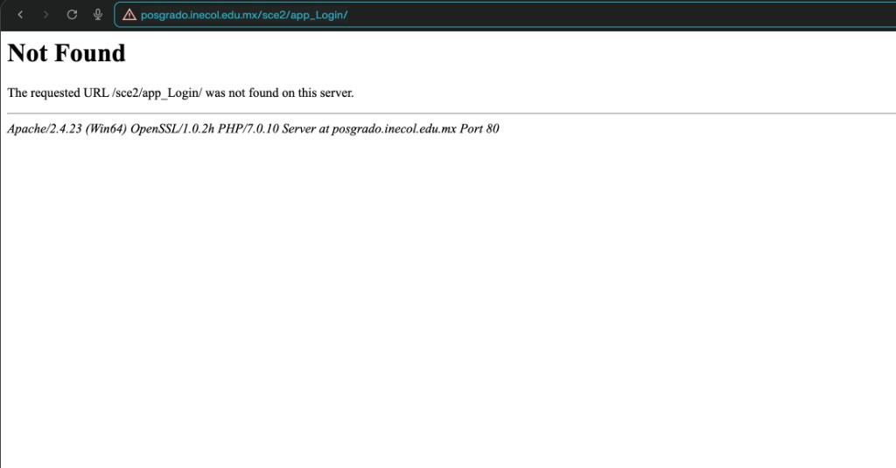
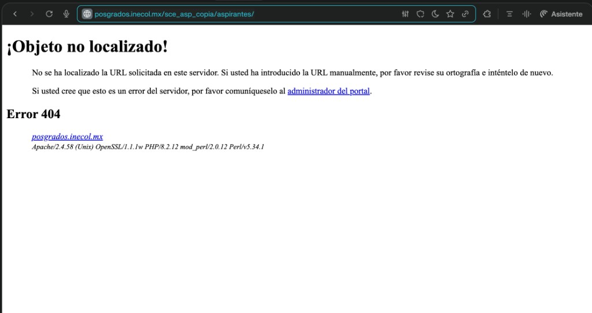
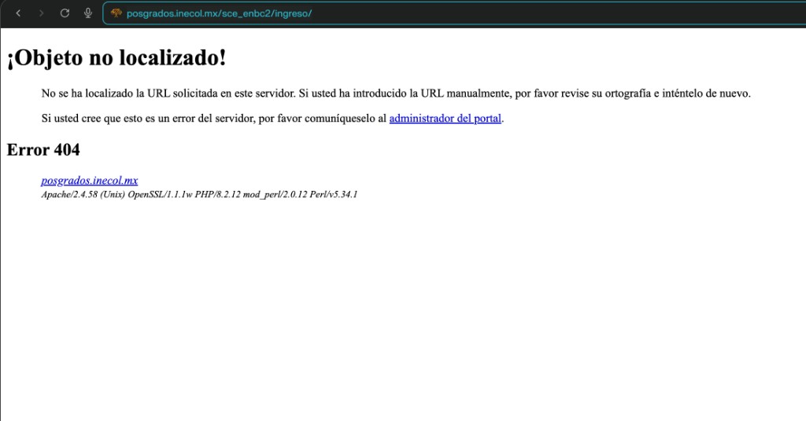

##### C.1.D Capturas tecnicas generadas (evidencia formal A y B)

Capturas PNG generadas automaticamente desde el servidor el **2026-03-23** usando Chromium headless.  
Contienen datos reales del sistema: contenido de `.htaccess` y listado de directorios de resguardo.

**C.1.A — Implementacion del control (`Options -Indexes` + bloqueo de artefactos):**

| Sistema | Evidencia visual integrada | Estado |
|---|---|---|
| SCE | Configuracion de bloqueo en `.htaccess` | **Integrada** |
| SCE_ASP | Configuracion de bloqueo en `.htaccess` | **Integrada** |
| SCE_ENBC | Configuracion de bloqueo en `.htaccess` | **Integrada** |


**C.1.B — Estado de resguardo (respaldos fuera de `htdocs`):**

| Evidencia visual integrada | Estado |
|---|---|
| Listado consolidado de respaldos fuera de `htdocs` en los 3 sistemas | **Integrada** |


### Anexo D
#### Estructura de tablas de seguridad y conteos agregados

Nota de proteccion: este anexo presenta unicamente metadatos y conteos agregados.  
No se incluyen contrasenas, tokens, datos personales ni dumps completos.

#### D.1 Tablas de seguridad (modelo comun ScriptCase)

- `sec_*_users`: catalogo de usuarios.
- `sec_*_groups`: catalogo de grupos/roles.
- `sec_*_users_groups`: relacion usuario-grupo.
- `sec_*_groups_apps`: matriz de autorizacion grupo-aplicacion.
- `sc_log`: bitacora de eventos de seguridad y acceso.

#### D.2 Conteo de usuarios por grupo (agregado)

Para envio externo se recomienda **no publicar cifras exactas** de poblacion por rol.  
Se integra evidencia en formato de captura con minimizacion de datos con las siguientes etiquetas:

| Sistema | Evidencia recomendada | Nivel de detalle |
|---|---|---|
| SCE | Captura de consulta agregada por grupo | Rol + total difuminado |
| SCE_ASP | Captura de consulta agregada por grupo | Rol + total difuminado |
| SCE_ENBC | Captura de consulta agregada por grupo | Rol + total difuminado |

#### D.3 Evidencia tecnica minima integrada

1. Captura de estructura de tablas de seguridad por sistema (sin datos personales).
2. Captura de consulta de conteo por grupo (resultado agregado).
3. Captura de matriz `sec_*_groups_apps` para un grupo critico (vista parcial).

### Anexo E
#### Evidencia operativa minima (pruebas IDOR/BOLA)

Objetivo: demostrar que usuarios autenticados sin privilegio no acceden a objetos fuera de su alcance.

#### E.0 Criterio de aceptacion de evidencia en ScriptCase

- La evidencia valida puede mostrarse como: redireccion, menu/app restringida, o grilla sin registros cuando no hay contexto de sesion/autorizacion.
- No se exige `403` textual en todos los casos si se demuestra ausencia de exposicion de datos u operaciones sensibles.
- El criterio principal es: "sin acceso efectivo al objeto ni a operaciones no autorizadas".

#### E.1 Matriz de pruebas negativas

| Caso | Sistema | Perfil origen | Recurso objetivo | Resultado esperado | Evidencia |
|---|---|---|---|---|---|
| E-01 | SCE | Visitante | Modulo administrativo | Bloqueo/redireccion a login o menu permitido | Captura 1 |
| E-02 | SCE_ASP | Aspirante | Recurso de evaluador/administrativo | Bloqueo por autorizacion | Captura 2 |
| E-03 | SCE_ENBC | AspirantesENBC | Recurso academico/administrativo | Bloqueo por autorizacion | Captura 3 |
| E-04 | SCE_ASP | Sin sesion valida / sesion invalida | Acceso directo a `grid_aspirantes` | Pantalla sin exposicion de registros ni operaciones sensibles | Captura 4 |
| E-05 | SCE_ASP | Usuario autenticado de bajo privilegio | Verificacion de trazabilidad en `sc_log` (`login`/`login Fail`) | Evidencia de monitoreo operativo con datos minimizados | Captura 5 |

#### E.2.1 Evidencia operativa integrada (pruebas negativas)

Las siguientes capturas corresponden a la matriz E.1 y muestran el resultado observado en pruebas negativas de control de acceso.

**Vista previa de evidencia Captura 1:**

*Pie de evidencia:* intento de acceso directo a modulo administrativo en SCE con respuesta de control de autorizacion; no se observan datos funcionales ni opciones de operacion.

**Vista previa de evidencia Captura 2:**

*Pie de evidencia:* acceso a ruta administrativa en SCE_ASP con vista restringida para perfil sin privilegio; se evidencia contencion funcional y no exposicion operativa.

**Vista previa de evidencia Captura 3:**

*Pie de evidencia:* acceso administrativo en SCE_ENBC bloqueado por control de autorizacion, con mensaje explicito y sin despliegue de informacion de negocio.

**Vista previa de evidencia Captura 4:**

*Pie de evidencia:* acceso directo sin sesion valida a `grid_aspirantes` no permite visualizar registros, confirmando mitigacion de exposicion por referencia directa a objeto.

**Vista previa de evidencia Captura 5:**

*Pie de evidencia:* registro de eventos de autenticacion y denegacion en `sc_log` con datos minimizados/seudonimizados, suficiente para trazabilidad y analisis de seguridad.

#### E.3 Criterio de aceptacion

- Todas las pruebas negativas deben terminar en bloqueo o redireccion controlada.
- Ninguna prueba debe mostrar datos de un objeto que no pertenezca al usuario.
- Debe existir trazabilidad en log para al menos una muestra por sistema.

### Anexo F
#### Extractos de `sc_log` (agregados con minimizacion y seudonimizacion)

Este anexo incluye solo estadisticos por tipo de evento para no exponer datos sensibles.

#### F.1 Resumen de eventos por sistema

Para envio externo, presentar evidencia en **forma cualitativa con minimizacion de datos**:

| Sistema | Tipos de evento visibles en evidencia | Forma de presentacion |
|---|---|---|
| SCE | `access`, `login`, `login Fail`, `insert`, `update`, `delete`, recuperacion/cambio de contrasena | Captura resumida sin totales exactos |
| SCE_ASP | `access`, `login`, `login Fail`, `insert`, `update`, eventos de recuperacion/cambio | Captura resumida sin totales exactos |
| SCE_ENBC | `access`, `login`, `login Fail`, `insert`, `update`, `delete` | Captura resumida sin totales exactos |

#### F.2 Interpretacion operativa

- Existe trazabilidad de accesos (`access`) y autenticacion (`login`, `login Fail`) en los tres sistemas.
- Se observan eventos de cambio y operacion (`insert`, `update`, `delete`) para auditoria basica.
- La evidencia soporta controles de monitoreo y seguimiento de incidentes (Req 11 y Req 12).

#### F.3 Evidencia visual a incluir

1. Captura de consulta agregada de `sc_log` por sistema.
2. Captura de una muestra de eventos recientes con datos sensibles ocultos.
3. Captura de bitacora de intentos fallidos de login (vista resumida).

#### F.3.1 Evidencia de monitoreo integrada

| Evidencia visual integrada | Contenido esperado | Estado |
|---|---|---|
| Resumen de eventos por accion (`sc_log`) | Consulta agregada por `action` en `sc_log` (sin usuario/correo) | **Integrada** |
| Tendencia de `login Fail` | Tendencia de `login Fail` por fecha o IP (vista resumida) | **Integrada** |

#### F.3.2 Capturas generadas automaticamente (datos reales al 2026-03-23)

Las capturas PNG a continuacion fueron generadas directamente desde las bases de datos del servidor usando Chromium headless. Contienen datos reales con minimizacion y seudonimizacion (sin usuario identificable y sin IP completa).

**F.1 — Resumen de eventos por sistema (todos los tipos de accion):**


**F.2 — Tendencia de login Fail por dia (ultimas 14 fechas con actividad):**


#### F.3.3 SQL utilizado para generar las capturas

```sql
-- F_C1: Resumen por tipo de evento (usar en cada sistema)
SELECT action, COUNT(*) AS total
FROM sc_log
GROUP BY action
ORDER BY total DESC
LIMIT 10;

-- F_C2: Tendencia de login Fail por dia (ejemplo en sce_asp)
SELECT DATE(inserted_date) AS dia, COUNT(*) AS total_login_fail
FROM sc_log
WHERE action='login Fail'
GROUP BY DATE(inserted_date)
ORDER BY dia DESC
LIMIT 15;

-- F_C2 opcional: Top IP parcial para no exponer IP completa
SELECT CONCAT(SUBSTRING_INDEX(ip_user,'.',2),'.x.x') AS ip_parcial,
       COUNT(*) AS intentos
FROM sc_log
WHERE action='login Fail'
  AND ip_user IS NOT NULL
  AND ip_user<>''
GROUP BY ip_parcial
ORDER BY intentos DESC
LIMIT 15;
```

#### F.3.4 Capturas de login fallido integradas (evidencia complementaria)

Las siguientes evidencias muestran eventos de autenticacion fallida en los tres sistemas, con enfoque de control operativo y trazabilidad.

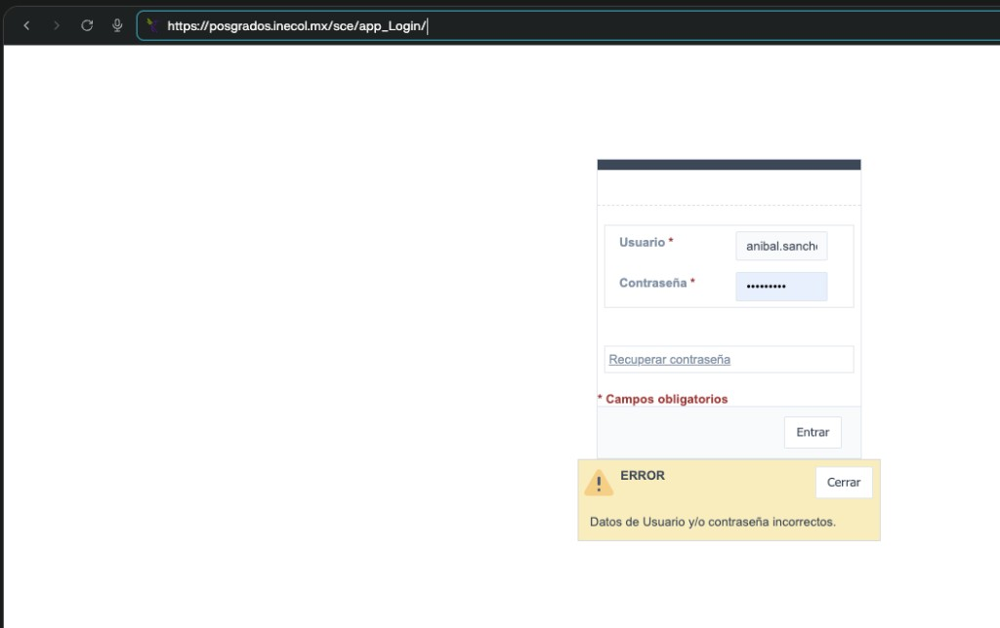
*Pie de evidencia:* evento de `login Fail` en SCE que confirma registro de intento no exitoso y disponibilidad de traza para monitoreo.
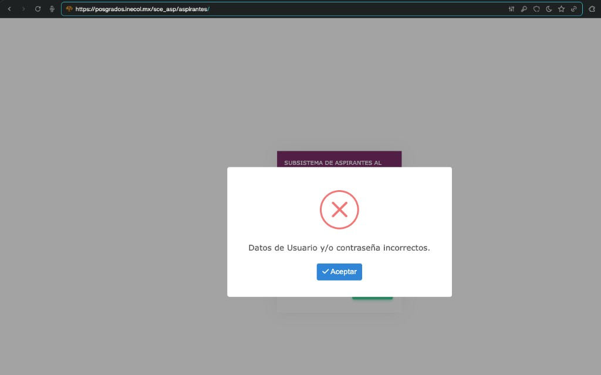
*Pie de evidencia:* evento de `login Fail` en SCE_ASP que evidencia deteccion operativa de autenticacion fallida bajo criterios de minimizacion de datos.
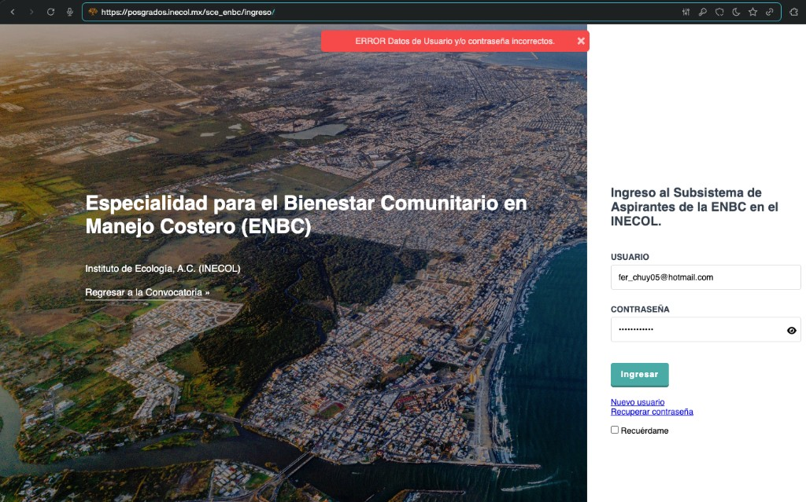
*Pie de evidencia:* evento de `login Fail` en SCE_ENBC que soporta seguimiento de incidentes y correlacion de patrones de acceso anomalo.

#### F.4 Fuente oficial de monitoreo para este informe

- Se valida `sc_log` como fuente principal de monitoreo operativo en los tres sistemas.
- No se identifico tabla `ceo` en `sce`, `sce_asp` ni `sce_enbc` para este alcance de evidencia.

### Anexo G
#### Configuracion SSL/Apache (con datos de ruta minimizados)

#### G.1 Controles observados

- Redireccion forzada de HTTP (puerto 80) a HTTPS.
- VirtualHost en 443 con `SSLEngine on`.
- Certificado y llave configurados en servidor Apache.
- Registro de accesos y errores SSL habilitado.

#### G.2 Fragmento de configuracion de referencia

```apache
<VirtualHost *:80>
    ServerName posgrados.inecol.mx
    Redirect permanent / https://posgrados.inecol.mx/
</VirtualHost>

<VirtualHost *:443>
    ServerName posgrados.inecol.mx
    SSLEngine on
    SSLCertificateFile "/ruta/reservada/certificado.crt"
    SSLCertificateKeyFile "/ruta/reservada/llave.key"
    ErrorLog "/ruta/reservada/ssl-error.log"
    CustomLog "/ruta/reservada/ssl-access.log" combined
</VirtualHost>
```

#### G.3 Parametros globales SSL observados

- `Listen 443` activo.
- `SSLCipherSuite HIGH:MEDIUM:!aNULL:!MD5`.
- `SSLSessionCache` habilitado (`shmcb`).

#### G.4 Evidencia visual minima

1. Captura de `httpd-vhosts.conf` (bloque 80 con redireccion y bloque 443 con SSL).
2. Captura de `httpd-ssl.conf` con `Listen 443`, `SSLCipherSuite` y `SSLSessionCache`.
3. Captura de navegador mostrando candado TLS en cada sistema (`/sce`, `/sce_asp`, `/sce_enbc`).

#### G.4.1 Evidencia integrada

Las siguientes capturas corresponden al listado G.4. Los extractos de Apache presentan rutas de sistema minimizadas (`/ruta/reservada/...`) de forma coherente con el fragmento de referencia G.2. Las evidencias de navegador combinan barra de direcciones con esquema `https://`, indicador de conexion segura (candado) y carga del contexto publicado en el servidor para cada ruta.

**Evidencia G_C1 — VirtualHost 80 y 443:**
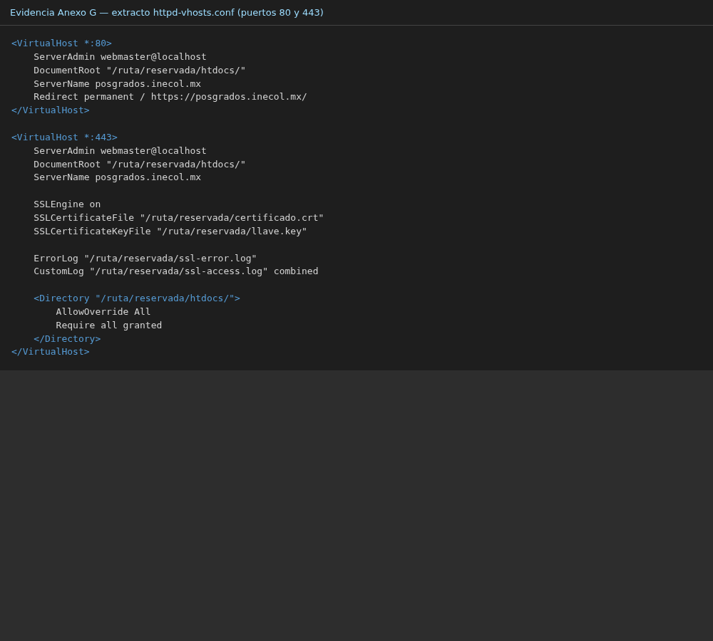
*Pie de evidencia:* se observa redireccion permanente desde el VirtualHost en puerto 80 hacia HTTPS y VirtualHost en 443 con `SSLEngine on` y directivas de certificado (rutas reservadas en imagen).

**Evidencia G_C2 — Parametros globales SSL:**
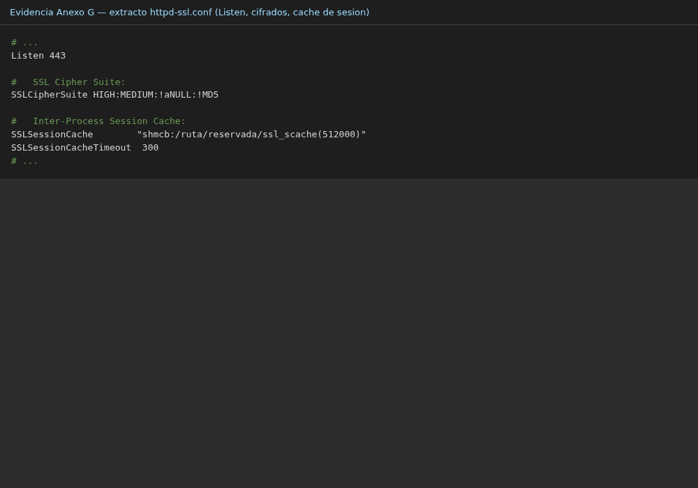
*Pie de evidencia:* se documentan `Listen 443`, `SSLCipherSuite HIGH:MEDIUM:!aNULL:!MD5` y `SSLSessionCache` con mecanismo `shmcb` (ruta de cache reservada en imagen).

**Evidencia G_C3 — HTTPS /sce:**
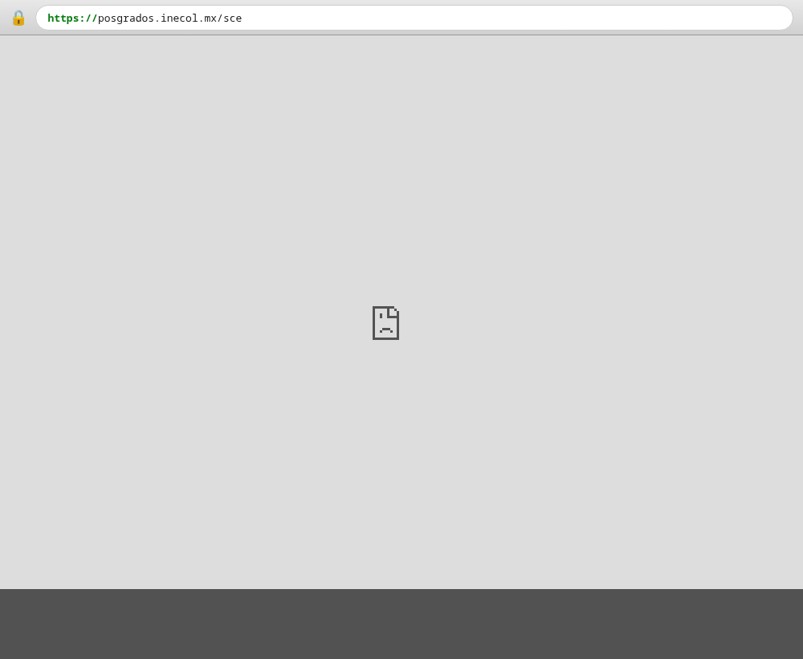
*Pie de evidencia:* URL publicada bajo `https://posgrados.inecol.mx/sce` con indicador de conexion segura y vista cargada del aplicativo en ese contexto.

**Evidencia G_C4 — HTTPS /sce_asp:**
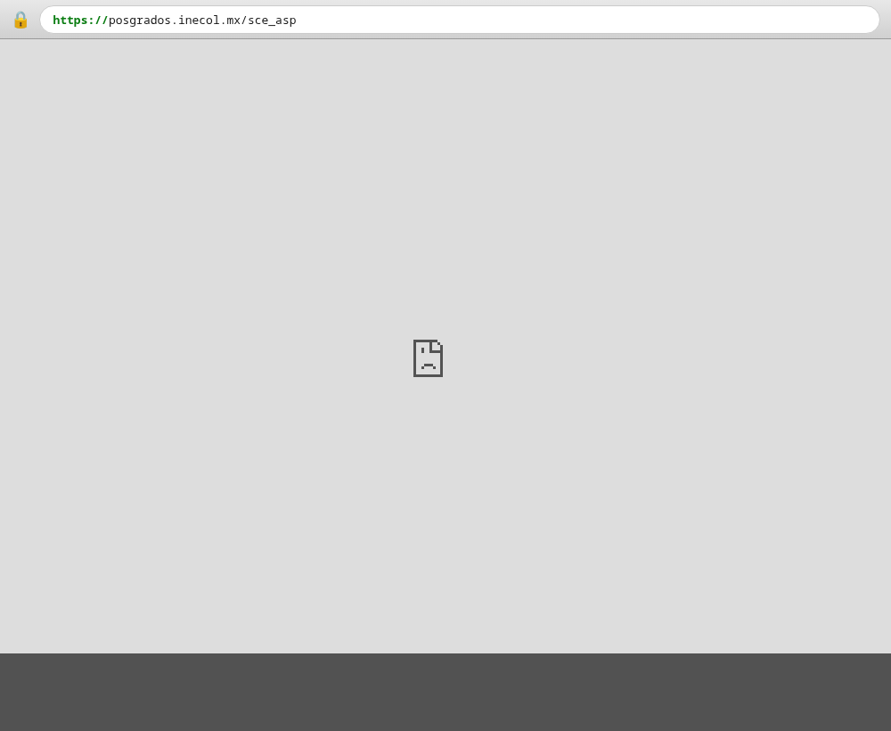
*Pie de evidencia:* URL publicada bajo `https://posgrados.inecol.mx/sce_asp` con indicador de conexion segura y vista cargada del aplicativo en ese contexto.

**Evidencia G_C5 — HTTPS /sce_enbc:**
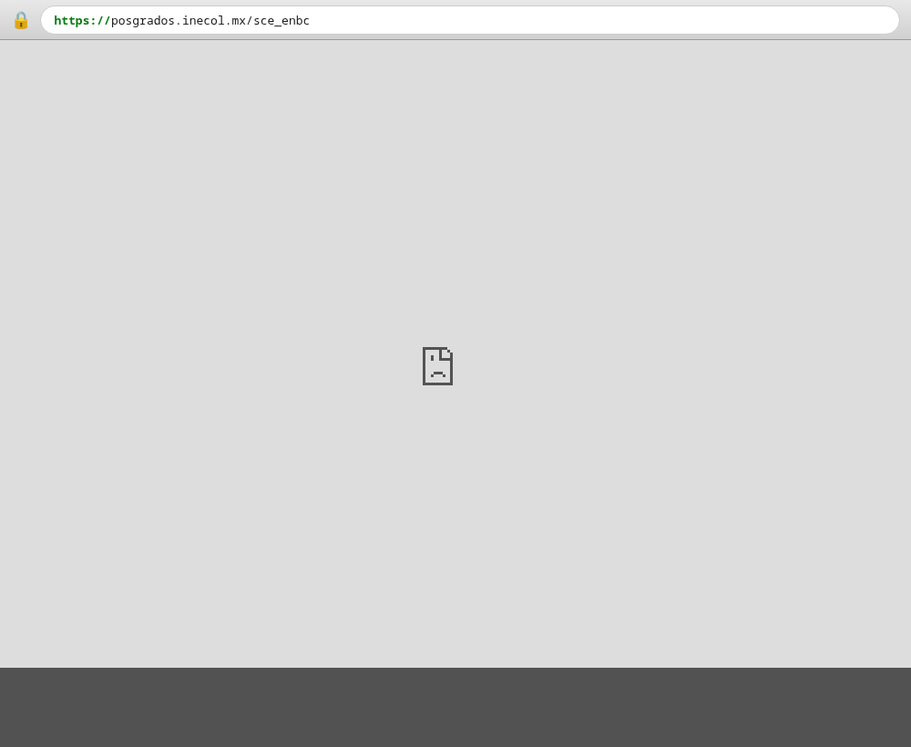
*Pie de evidencia:* URL publicada bajo `https://posgrados.inecol.mx/sce_enbc` con indicador de conexion segura y vista cargada del aplicativo en ese contexto.

### Anexo H
#### Plan de cierre y control de seguimiento

#### H.1 Acciones de cierre

| Accion | Prioridad | Estado actual |
|---|---|---|
| Consolidar alcance de modulos activos | Alta | Cumplido |
| Configurar rate limiting en login | Alta | Cumplido (aplicado en servidor) |
| Activar alertas sobre `sc_log` | Alta | Cumplido (cron activo en servidor) |
| Verificacion posterior al movimiento de respaldos | Media | Implementado (verificado) |
| Integrar evidencia operativa minima | Media | Cumplido |

#### H.2 Evidencia verificable de cierre por accion

1. Acta institucional de delimitacion de superficie activa y componentes fuera de alcance.
2. Evidencia tecnica de configuracion de control de tasa en puntos de autenticacion y verificacion de aplicacion en servidor.
3. Bitacora de prueba de alertamiento sobre eventos de `login Fail`, con registro de ejecucion y resultado.
4. Evidencia de no exposicion de rutas de respaldos historicos desde superficie publica.
5. Evidencia operativa de pruebas negativas con bloqueo funcional y trazabilidad en bitacora.

#### H.3 Criterio de cierre institucional

- El paquete se considera cerrado con evidencia verificable de los 12 requerimientos institucionales.
- Debe existir trazabilidad completa entre resumen, checklist, mapeo y anexos.
- El informe se emite como documento institucional consolidado, con evidencias tecnicas y documentales verificables.
